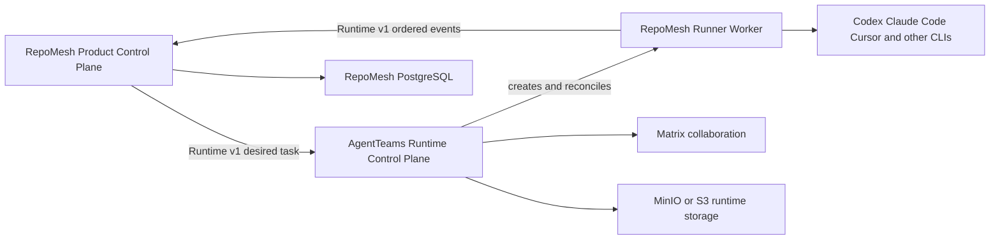

# RepoMesh Runtime Planes

## Product Shape

RepoMesh is one product and release composed of three process boundaries:

The external product API and UI belong to RepoMesh. AgentTeams Controller, Matrix, object storage,
and Worker management remain private runtime services.

## Command Flow

1. RepoMesh confirms project scope, specification, task, context bundle, and permission delegation.
2. RepoMesh persists a CodingRun and runtime resource binding before any external side effect.
3. The outbox publishes an idempotent desired-runtime command.
4. AgentTeams reconciles Manager, Worker, and Team resources carrying Runtime v1 metadata.
5. An AgentTeams-managed Worker starts RepoMesh Runner.
6. Runner materializes immutable context read-only and creates an isolated repository worktree.
7. Runner selects a coding CLI adapter, executes the task, runs validation, and retains the native
   session ID for interrupt or resume.
8. Runner publishes ordered Runtime v1 events and immutable artifact references.
9. RepoMesh ingests events through an idempotent inbox and advances its own business state.

Matrix may notify humans or carry collaboration messages, but it is not the command queue or event
store for this flow.

## Ownership Rules

| Change | Owning location |
| --- | --- |
| Project, task, context, approval, validation, delivery behavior | `src/repomesh/modules` |
| Coding execution state machine and native CLI session | `src/repomesh_runner` |
| Manager/Worker/Team desired-state reconciliation | `components/agentteams` |
| Cross-process task, event, metadata, and compatibility shape | `contracts/runtime` |
| Controller and Matrix protocol mapping | `src/repomesh/integrations/agentteams` |
| Product composition, config, lifecycle, and dependency health | `src/repomesh/bootstrap` |

When a change crosses two rows, the contract change is reviewed and merged before either
implementation depends on it.

## Storage Boundaries

- RepoMesh PostgreSQL is the fact source for enterprise delivery state.
- AgentTeams desired/runtime resources are replaceable projections.
- Runner local state is a lease and cache, never the only copy of a durable result.
- Immutable context and artifacts use separate logical buckets or prefixes with URI and hash
  references in RepoMesh.
- Credentials are resolved from scoped references at runtime and never serialized into Runtime v1
  messages, context files, Matrix messages, or logs.

## Release Identity

A product release records four compatibility values:

1. RepoMesh product version and commit.
2. AgentTeams product-fork commit.
3. AgentTeams official-upstream base commit.
4. Runtime contract version.

The first local AgentTeams Controller change is blocked until a product fork exists and all four
values can be produced by the build.

## Implementation Sequence

1. Runtime v1 contracts and Runner core.
2. Agent Directory resource-binding persistence and idempotent event inbox.
3. Project/task-to-AgentTeams provisioning application service.
4. Runner transport, workspace, coding adapter, test loop, and artifact adapters.
5. AgentTeams correlation metadata, lifecycle event, visibility, and skill-policy changes.
6. Unified gateway, authentication, UI, Compose, and Helm release.
