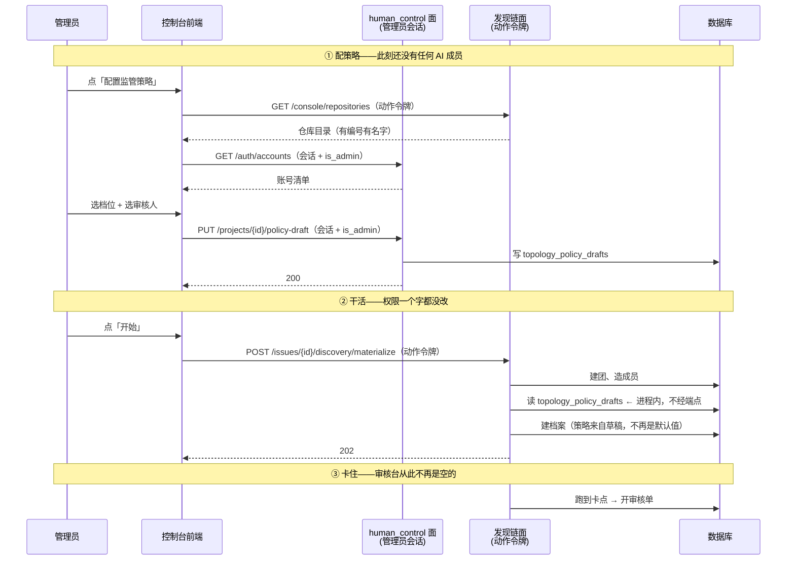

# 监管策略配置：设计方案

- 日期：2026-08-14
- 状态：**待批准动工**
- 前置阅读：[`supervision-policy-window-20260814.md`](supervision-policy-window-20260814.md)（问题分析、被否决的方案、域不变量）
- 取代：`web-to-frontend-batch5-20260814.md` §3「落点」一节

### 修订记录

| 版本 | 改了什么 |
| --- | --- |
| 10:43 初稿 | 草稿表 + 鉴权拆分 + 端点 + 改动清单。界面按**两档**设计，授权按**完整六字段**暴露 |
| **本版** | 界面改为**三档**（第三档带代价预告）；授权默认改为**三个预设角色**、完整六字段降为「逐项配置」展开项；补入全景图、时序图、界面线框；施工顺序细化为分步骤 |

---

## 0. 一句话

**把「设策略」和「用策略」拆成两个动作**：设策略写进一张新的草稿表，走管理员会话；
建档案时去读那张表，走原有的物化路径。两边的权限各自不动，时序死结自然解开。

---

## 1. 已定下的前提

| 来源 | 内容 |
| --- | --- |
| 用户裁决 | 流程顺序＝提需求 → 自动分析 → **配置策略** → 建团队/档案 → 干活 |
| 用户裁决 | 不照抄 `web/` 的 `ProjectSetup`，**在 `frontend/` 里重新设计** |
| 用户裁决 | 界面上是**三档**（本版修订，初稿为两档） |
| 分析结论 | 授权默认收敛成**三个预设角色**；完整六字段保留在「逐项配置」里，不删 |
| 分析结论 | 建档案那一步不该自己填默认值，该接收传入的策略 |
| 分析结论 | 策略不能搭物化的车提交——那会绕过 `is_admin`（见前置文档 §3.B） |

### 1.1 重新设计的边界

**能重新设计的是界面和说法，不是语义。**

| 可以重新设计 | 不能（除非后端立项） |
| --- | --- |
| 界面分几步、怎么措辞、默认填什么 | 三个档位的取值 `auto`/`supervised`/`manual_controlled` |
| 给用户看几档、每档叫什么 | 六个卡点是哪六个（固定，不可自定义） |
| 把七个控制动作打包成几个角色 | 七个动作本身 |
| 哪些字段不给用户看 | 四条域不变量（`domain.py:265-274`） |

`web/` 的 `ProjectSetup` 不能照抄，四处具体毛病：

1. 要手工填组织编号、总管编号、每仓 Leader/Worker——控制台里这些全是自动产生的
2. 用 `crypto.randomUUID()` 现造项目编号，造出的项目与任何需求都对不上号（库里已有一个这样的孤儿：`09764c07-23eb-544e-ba1a-dc842edb81c9`）
3. 默认卡点组合无依据，也未告知各自会开出多少张单
4. 审核人的代码权限写死 `write`——一个只需点头的人不需要改代码的权限，应为 `read`

---

## 2. 全景

### 2.1 三条流程摆在一起

```
老（web/）        装机建团 ──────► 配策略 ──────► 干活 ──────► 审批
                  └ 成员此刻已存在   └ 有充裕窗口

现状（控制台）    提需求 ──► 自动分析 ──► ┌ 建团 + 建档案 ┐ ──► 干活
                                          └ 同一瞬间，无缝 ┘
                                                 ▲
                                     配策略要插这里，但没有缝
                                     ⇒ 档案永远是 auto + 零卡点
                                     ⇒ 审核台恒空（实测 0 行）

本方案            提需求 ──► 自动分析 ──► 配策略 ──► 建团 + 建档案 ──► 干活
                                          └ 写草稿表    └ 读草稿表
                                             管理员会话     进程内调用
```

关键差别：**配策略不再需要「插进」建档案那一步**，它提前落在一张独立的草稿表上，
建档案时去读。两个动作在时间上分开，在权限上也分开。

### 2.2 一次配置的时序（含凭据）



**这张图要看的是两条泳道从不交叉**：写策略只走管理员会话那条，
读策略是建档案时的进程内调用，不经过任何端点。共享的动作令牌
自始至终碰不到策略的写路径。

---

## 3. 落点：界面出现在哪

### 3.1 发现链面板底部，物化按钮的正上方

**不进步进器。** 面板里已有的注释把判据说清楚了（`components/DiscoveryPanel.tsx:61-62`）：

> 步进器仍只有四格：物化不是发现链的第五步（发现四步改的是同一份草稿快照，
> 物化建的是执行面的实体）。

按这条判据，配策略**改的也是草稿、不建实体**，本可以算发现链的一步；但它不属于
「发现」这件事——发现是「要动哪些仓库」，策略是「谁来盯着」。两件事不该共用一个
步进器，否则「走到第几步」这个唯一事实源就要为一件与发现无关的事让路。

**所以：物化区上方加一张「监管策略」卡片，与物化按钮同级。**

### 3.2 卡片的两种状态

未设：

```
┌─ 监管策略 ──────────────────────────────────────────────┐
│                                                          │
│   本次将以 全自动 运行，没有任何人工卡点。               │
│   这个需求不会产生任何审核待办。                         │
│                                                          │
│                                            [  配置  ]    │
└──────────────────────────────────────────────────────────┘
```

那句话不是警告，是陈述——它就是不设时的真实后果。**这句话本身就是这批迁移的目的**：
让 12/14 那个数字不再是「没人被问过」的产物。

已设：

```
┌─ 监管策略 ──────────────────────────────────────────────┐
│                                                          │
│   关键处我看一眼  ·  3 个人工卡点                        │
│   仓库范围 · 交付 · 异常升级（强制）                     │
│   审核人：1 位 · 5e6be6e2 项目监督人                     │
│                                                          │
│                                            [  修改  ]    │
└──────────────────────────────────────────────────────────┘
```

> **这张线框初稿错了三处，施工第 6 步实测订正：**
>
> 1. **卡点组写的是被废弃的那一组**（「规格 · 交付」）。§4.2 的修正框已把第二档预设
>    换成「仓库范围 · 交付」，而这张线框举的正是实测出「审核台依然是空的」那一组。
> 2. **「3 处会停下来等人」与 §4.2 算的「2 次」自相矛盾。** `exception_escalation`
>    的开单粒度是「出异常才开」（§4.3 表），它是一个**待命的**卡点，不是一次必然的停顿。
>    所以卡片数的是**卡点个数**（3 个），预告数的是**预期停顿次数**（2 次）——
>    两个数不同不是 bug，但必须用不同的量词说，否则用户会以为其中一个错了。
> 3. **审核人不显示人名。** 补人名要调只有管理员能用的 `GET /auth/accounts`，而草稿的
>    读权限是「管理员**或**被授权人」——非管理员的被授权人读得到策略却拿不到名字，
>    同一份策略会对两个账号显示成两个样子。5-1a 已就此裁决过（人名：不查），卡片照办：
>    短 id + 完整 id 挂 `title` + 身份 + 动作标签。要改成显示人名，得先推翻那条裁决。

### 3.3 物化弹窗里再显示一次

`MaterializeModal` 加一行策略摘要。理由：按下那个按钮之后档案就锁死了，
**最后一次能看到自己选了什么的机会必须在按钮旁边**。

### 3.4 档案已存在之后（初稿写「已物化之后」，那个说法比真实状态窄）

`GET /projects/{id}/topology` 拿得到真档案，走迁移 5-1a 已经做好的只读显示。
草稿卡片这时不再出现（不给一个按了也没用的按钮）。

⚠ **判据是「档案在不在」，不是「物化成没成」**，两者不等价：
`EnsureProjectAgentTopology` **先写档案**，物化的后半段（建团、开房、起计划）还可能失败。
施工第 6 步的实走就落在这个中间态——**档案已建、团队 4 行、无轮次、物化答 503、可重试**。

这一态下卡片消失仍然是对的（门就是拓扑端点，而全仓确实没有更新档案的接口，
按钮真的没用），但文档不能说成「物化成功之后」，否则下一个人会去找一个并不存在的
「物化成功」标志。

**取数只做一次。** 拓扑的判定在 `IssueDetailPage` 做，发现链面板不自己再取一遍——
两个取数点在物化那一瞬间必然互相矛盾。`forbidden`（403）归入「已封」：后端的 404
判定在权限判定之前，**能答 403 就说明档案存在**。

---

## 4. 界面设计

控制台的语境跟老那套完全不同：用户此刻刚走完发现链（分析完、分档批完），
心里的事是「这需求要动这几个仓库，我认了」。此时该问他的是一句人话，
不是「请选择执行模式并配置人工检查点与授权」。

**整个弹窗只问两件事。**

### 4.1 弹窗线框

```
┌────────────────────────────────────────────────────────────────┐
│  配置监管策略                                              ✕   │
│  需求：给结算服务加多币种支持                                  │
├────────────────────────────────────────────────────────────────┤
│                                                                │
│  这活谁说了算？                                                │
│                                                                │
│  ┌──────────────────────────────────────────────────────────┐ │
│  │ ○   AI 自己干完                                          │ │
│  │     从规格一路跑到交付，中途不会为任何一步停下来。       │ │
│  │     ▸ 需要你点头 0 次                                    │ │
│  └──────────────────────────────────────────────────────────┘ │
│  ┌──────────────────────────────────────────────────────────┐ │
│  │ ●   关键处我看一眼                            〔推荐〕   │ │
│  │     在规格定稿、提交交付这两处停下来等你。               │ │
│  │     ▸ 估计需要你点头 3 次                                │ │
│  │     ▸ 异常升级始终启用（后端强制，非全自动时不可关）     │ │
│  │       ⌄ 改要停哪几处                                     │ │
│  └──────────────────────────────────────────────────────────┘ │
│  ┌──────────────────────────────────────────────────────────┐ │
│  │ ○   每一步都要我点头                                     │ │
│  │     六个检查点全部生效，每个任务开工前都要你确认。       │ │
│  │     ⚠ 估计需要你点头 11 次，且随任务数增长              │ │
│  └──────────────────────────────────────────────────────────┘ │
│                                                                │
│  ──────────────────────────────────────────────────────────    │
│                                                                │
│  谁来看？                                                      │
│                                                                │
│  ┌──────────────────────────────────────────────────────────┐ │
│  │  人      〔 张三（zhangsan）              ⌄ 〕           │ │
│  │  能干啥   ○ 只看    ● 能批能退    ○ 全权                 │ │
│  │                                        ⌄ 逐项配置        │ │
│  │                                                      ✕   │ │
│  └──────────────────────────────────────────────────────────┘ │
│                                            〔 + 再加一个人 〕  │
│                                                                │
├────────────────────────────────────────────────────────────────┤
│                                    〔 取消 〕  〔 保存策略 〕  │
└────────────────────────────────────────────────────────────────┘
```

选「AI 自己干完」时，下半截整个隐藏——那一档**不许**有授权（`domain.py:266`
只在非 `auto` 时要求授权；但真正的硬约束在卡点侧：`auto` 带任何卡点即拒）。

### 4.2 第一问：三档与代价预告

「代价预告」是这个设计比照抄强的地方——**老那个界面从头到尾没告诉你选完会发生什么。**

数字算得出来，来源前端此刻就有：

```
T = 计划里的任务节点数     ← integration.task_dag_count（contract.ts:1048）
```

各档的估算式（依据 §4.3 实测的开单粒度**与可达性**）：

| 界面档位 | 会停下来的地方 | 估算式 | 举例（T=4） |
| --- | --- | --- | --- |
| AI 自己干完 | 无 | `0` | **0 次** |
| 关键处我看一眼 | 仓库范围（每项目）+ 交付（每轮） | `2` | **2 次**，且不随规模增长 |
| 每一步都要我点头 | 六个全开，其中「规格」当前无触发点 | `T + 3` | **7 次** |

> ### ⚠ 两处修正（施工第 2 步实测，2026-08-14）
>
> **1. 第二档的预设从「规格 + 交付」改成「仓库范围 + 交付」。**
> 原预设配下去，物化后审核台**依然是空的**。实测：`supervised` +
> `["specification","delivery"]` 的项目走完发现链、物化返回 200，
> `project.human_review_requests` 仍为 **0 行**；把卡点换成含 `repository_scope`
> 的组合，物化返回 **409 `human_checkpoint_pending`**，审核单从 0 变成 1 行，
> 且 `start_plan` 调用数为 0（闸门确实拦在启动之前）。原因见 §4.3.1。
>
> 这条直接回答了 §12 原待裁决第 1 条：**「仓库范围」不是可选项，是第二档的必需项**
> ——它是**物化路径上唯一可达的卡点**。没有它，用户配完策略后要一直等到交付阶段
> 才看得到第一张审核单，而「审核台恒空」正是这批迁移要解决的问题。
>
> **2. 初稿第三档举例的「11 次」是算错的。** 按当时自己列的式子 `1+R+T+1+1`
> （R=2, T=4）应得 9。现式子因「规格」不可达已变为 `T+3`＝7。

⚠ **必须标成「估计」**，两处不精确，都要在界面上说明：

1. 证据版本变化会**重新开单**（`checkpoint_control.py:160-172` 第二个
   `_reviews.ensure`），所以返工会让实际次数高于估算；
2. `T` 取自计划生成那一刻的任务节点数，返工重排会改变它。

（初稿这里的第 1 条讲的是 `R` 的超集问题。`R` 已从所有式子里消失——它只服务于
「规格」卡点，而那个卡点当前不可达。若将来 D-8 落地使其可达，这一条要一并复活。）

不写这两条就是在编造精确度，违反本项目的诚实数据体例。

### 4.3 六个卡点的开单粒度（实测）

第三档那个警告不是拍脑袋，是这张表算出来的：

| 卡点 | 开单粒度 | 出处 | 传 `repository_id` | **可达？** |
| --- | --- | --- | --- | --- |
| 仓库范围 | 每项目一次 | `change_orchestration/application.py:243` | 不传 | ✅ 物化路径上 |
| 规格 | 每个仓库一次 | `specification/application.py:208` | 传 | ❌ **见 §4.3.1** |
| 执行 | **每个任务一次** | `task_orchestration/application.py:412` | 传 | ✅ 任务启动时 |
| 验证 | 每轮一次 | `scm/plan_delivery.py:93` | 不传 | ✅ 交付前 |
| 交付 | 每轮一次 | `scm/plan_delivery.py:100` | 不传 | ✅ 提 PR 前 |
| 异常升级 | 出异常才开 | `task_orchestration/application.py:462` | 传 | ✅ 报异常时 |

### 4.3.1 「规格」卡点当前没有可达的触发点

初稿把这一行的开单粒度和调用点都写对了，但**漏了问它到底会不会被调到**。会不会被调到，
和粒度是两件事——三环查证：

1. `ProjectCheckpoint.SPECIFICATION` 的**唯一** evaluate 在
   `specification/application.py:208`，被 `if specification.kind is not
   SpecificationKind.TASK:` 守着——**只有非 TASK 规格才评估卡点**；
2. 全仓 `publish_to_context` 的**唯一**调用方是 `integrations/orchestration.py:129`，
   而它发布的规格在 `:109` 明写 `kind=SpecificationKind.TASK` → 守卫恒为假 → 卡点被跳过；
3. `change_orchestration/application.py:259` 造的 `ENGINEERING` 规格，此后只被
   log 一次（`:276`）和塞进一个视图（`:482`），**从未 approve、从未 publish**。

所以这个卡点勾了也不会停。**界面上的处置**（与 §4.5.1 那两个空动作同一条纪律）：

- 它**不进**第二档的预设；
- 展开「改要停哪几处」时**仍然列出**（它是合法枚举值，后端收），但标注
  「当前无可达触发点，勾选不会产生审核单」；
- 代价预告里按 **0** 计入。

**不做的事**：不把它从界面上删掉。删掉会让「界面能表达的」窄于「契约允许的」，
而且这是个**待修的缺陷**（已记 D-8），不是一个永久的语义。

**「执行」是唯一随任务数线性增长的**，所以第二档的预设里不含它。活体库当前
最大的需求是 2 仓 4 任务（13 个项目，均值 2.7），第三档大约 11 次尚可忍；
真实项目几十个任务时这一档就没人愿意用了——**但保留它并如实预告，好过砍掉它**。

### 4.4 异常升级：勾不勾都一样，必须说出来

`requires_human_checkpoint`（`modules/project/human_control.py:64-68`）整个函数三行：

```python
if topology.execution_mode is ProjectExecutionMode.AUTO:
    return False
if checkpoint is ProjectCheckpoint.EXCEPTION_ESCALATION:
    return True                    # ← 不看 required_checkpoints
return checkpoint in topology.required_checkpoints
```

界面上固定勾选并置灰，旁注「非全自动时始终启用」。不这么做，用户会以为不勾就不会被打断。

### 4.5 第二问：三个预设角色

后端给的是七个原子动作，直接摆出来让用户勾是没法用的——没人知道「恢复项目」
和「暂停项目」该不该一起勾。

| 界面上写 | 底下勾哪几个 `control_actions` |
| --- | --- |
| 只看 | `view_decisions` |
| **能批能退**（默认） | `view_decisions` + `approve_checkpoint` + `request_changes` |
| 全权 | 上面三个 + `pause_project` + `resume_project` + `cancel_project` |

⚠ **「全权」是六个，不是七个。** `edit_specification` 被刻意排除，理由见 §4.5.1。

### 4.5.1 七个动作里有两个是空的，界面不许假装它们存在

查证结果（`authorize_human` 全仓仅两个调用点）：

| 动作 | 真的被强制执行吗 | 执行点 |
| --- | --- | --- |
| `approve_checkpoint` | ✅ | `checkpoint_control.py:84-88` |
| `request_changes` | ✅ | 同上 |
| `pause_project` / `resume_project` / `cancel_project` | ✅ | `lifecycle_control.py:25-29` 的 `_STATUS_BY_ACTION` |
| **`view_decisions`** | ❌ **全仓只在枚举定义那一行出现**（`contracts.py:39`） | 无 |
| **`edit_specification`** | ❌ **同上**（`contracts.py:45`） | 无 |

`edit_specification` 是一个**声明了权限、但被守卫的那个功能根本不存在**的动作——
`specification` 模块有 7 个 py 文件，**没有 api 目录、没有任何 HTTP 路由**，
全仓没有规格的写端点。勾上它不产生任何效果。

`view_decisions` 同理：审核台的可见性是按人查的（`list_for_human`），不看这个动作。

**界面上的处置**：

- 「全权」角色**不含** `edit_specification`——一个角色不该默认包含不存在的能力；
- 逐项配置（§4.6）里这两项**保留但标注**「该动作暂无对应功能，勾选不产生效果」，
  不隐藏——它们在后端枚举里是合法值，隐藏会让「界面能表达的」与「契约允许的」错位；
- `view_decisions` 仍进「只看」与「能批能退」，因为它是这两个角色**语义上**的组成部分，
  且将来实现时无需回头改数据。

不这么做就是在界面上撒谎：用户勾了「改规格」，会以为自己拿到了某种能力。
这与本项目「无源字段显未接入，不编造」是同一条纪律。

其余字段的默认值：

| 字段 | 默认 | 为什么 |
| --- | --- | --- |
| 身份 `role` | `project_supervisor` | 选「仓库监督人」**必须**指定仓库、选另两种**不许**指定（`domain.py:57-61`）。默认管整个需求，就只能是项目监督人 |
| 代码权限 `code_access` | `read` | 一个只需点头的人不需要改代码的权限。`web/` 写死 `write` 是过度授权 |
| 管哪个仓库 `repository_id` | `null`（整个项目） | 同上，与 `project_supervisor` 绑定 |
| 管哪些路径 `path_patterns` | `[]` | 路径范围需先有仓库范围（`domain.py:62`） |

### 4.6 「逐项配置」展开后

初稿的完整六字段形态**保留**，降为展开项。默认收起，展开后：

```
┌──────────────────────────────────────────────────────────┐
│  人        〔 张三（zhangsan）                  ⌄ 〕     │
│  身份      ○ 组织监督人  ● 项目监督人  ○ 仓库监督人      │
│  管哪个仓库 〔 ——（整个项目）              ⌄ 〕（禁用）  │
│  管哪些路径 〔                                  〕（禁用）│
│  代码权限   ○ 不读代码   ● 可读代码   ○ 可写代码         │
│  能干哪些事 ☑ 看决定      ☑ 批准卡点   ☑ 要求返工        │
│             ☐ 暂停项目    ☐ 恢复项目   ☐ 取消项目        │
│             ☐ 改规格                                     │
└──────────────────────────────────────────────────────────┘
```

**身份和范围绑死**（`domain.py:57-63`，界面必须照做否则必被后端拒）：

- 选「**仓库**监督人」→ 仓库下拉**变必填**
- 选另外两种 → 仓库下拉**禁用并清空**（填了会被拒）
- 路径行只在仓库已选时可用
- 能干哪些事 **≥1**，全不勾即拒

**同一个人可以有多条授权**，只要「人 + 仓库」这一对不重复（`domain.py:278`）。
所以这是一个可增删的列表，不是单选。迁移 5-1a 的只读显示已按这个形状做了，两边对得上。

### 4.7 仓库下拉的选项从哪来

窗口期内前端**只有仓库名字、没有编号**（前置文档 §5.1 已验）。所以：

**选项 = `GET /console/repositories`（有编号有名字）∩ 发现链分档结果（只有名字），
按名字取交集。** 用户选中的项自带编号，草稿存编号。

⚠ **这个弹窗里会同时出现两套凭据，且这是正确的，不是笔误：**

| 调用 | 凭据 | 客户端 |
| --- | --- | --- |
| 列仓库目录 | 动作令牌 | `api/client.ts` |
| 列账号、读写草稿 | 管理员会话 | `api/auth.ts` 的 `sessionRequest` |

代码里必须写明这一点。给 human_control 面带 `Authorization` 头会让后端拿动作令牌
去验会话，**cookie 有效也 401，且失败是静默的**——下一个人若把其中一处「修正」成
另一套，会得到一个不报错的空白面板。

名字在目录里解析不到的仓库：**列出来说明「不在仓库目录中，无法限定范围」**，不静默跳过。
（后端 `_ensure_topology` 对解析不到的名字是静默跳过的，`discovery_materialization.py:437`
——那是它的语境，前端不照抄。）

### 4.8 界面三档 → 后端取值

**三档是界面概念，后端取值是提交时算出来的。**

```
   界面                        提交时                          域不变量
────────────────────────────────────────────────────────────────────────
AI 自己干完      ──►  execution_mode = "auto"           ──►  卡点必须空 ✓
                      required_checkpoints = []              授权可空   ✓
                      human_grants = []

关键处我看一眼   ──►  execution_mode = "supervised"     ──►  卡点 ≥1    ✓
                      required_checkpoints =                 授权 ≥1    ✓
                        ["specification", "delivery"]
                      human_grants = [至少一条]

每一步都点头     ──►  execution_mode =                  ──►  六个全齐   ✓
                        "manual_controlled"                  授权 ≥1    ✓
                      required_checkpoints = 六个全
                      human_grants = [至少一条]
```

**第二档展开「改要停哪几处」后勾满六个 → 自动升格为 `manual_controlled`。**
反之从第三档取消任一项 → 自动降为 `supervised`。用户不需要知道这两个词的存在。

这样四条域不变量**全部自动满足**，界面不可能提交出 422。

---

## 5. 数据：一张草稿表

```
project.topology_policy_drafts
  project_id            uuid        PRIMARY KEY          -- 契约 §0：即 issue_id
  execution_mode        varchar(30) not null default 'auto'
  required_checkpoints  jsonb       not null default '[]'
  human_grants          jsonb       not null default '[]'
  created_by            uuid        not null             -- 设它的那个本地账号
  created_at            timestamptz not null
  updated_at            timestamptz not null
```

三列的类型与名字**照抄** `project.agent_topologies`（实查该表：`execution_mode` 为
`varchar(30)`，另两列为 `jsonb`）。同名同型是有意的——建档案那一步是整列搬过去，
不做形状转换，少一次出错的机会。

**为什么单独一张表，不塞进发现链的草稿快照：**

1. 策略是 `project` 模块的东西，快照是 `repository_intelligence` 模块的。
   `EnsureProjectAgentTopology` 就在 `project` 模块内，读同模块的表天经地义；
   反过来要跨模块取一块和发现无关的数据。
2. 快照结构是发现链契约的一部分，塞一块非发现数据进去，`GET …/discovery`
   的形状就得跟着变。
3. 草稿可以**先于**发现链存在，也可以在物化后**留着**——「当初设的是什么」是一份
   独立于最终档案的记录。塞进快照就绑死了生命周期。

主键用 `project_id` 而不是自增 id：一个需求只有一份策略意图，与最终档案表的
`UniqueConstraint("project_id")` 同构。覆盖写就是覆盖写，不留版本——要留痕的是
**决定**（`checkpoint_decisions` 已经在留），不是决定之前的反复。

迁移文件：`20260814_0030_topology_policy_drafts.py`，`down_revision = "20260814_0029"`
（实查链尾为 `20260814_0029_delivery_policies.py`）。

---

## 6. 鉴权：整个方案的关键

前置文档否决方案 B 的理由是两个端点的守卫不对称：

| 端点 | 守卫 |
| --- | --- |
| `POST /issues/{id}/discovery/materialize` | `dependencies=[ACTION_TOKEN]`（全控制台共享） |
| `POST /projects/automatic-topologies` | `_account` + `is_admin` |

**本方案怎么绕过这个理由**——把一个动作拆成两个，各走各的门：

```
写策略   PUT /projects/{id}/policy-draft     管理员会话      ← 权限没有降低
用策略   物化路径读草稿表                     不经过任何端点   ← 权限没有提升
```

物化端点的守卫**一个字都不改**。它多做的事只是「去 project 模块读一张表」，
这是进程内调用，不是一次带凭据的请求。

### 6.1 这样安全吗——逐条对照

| 攻击面 | 结论 |
| --- | --- |
| 持共享令牌者能不能**设**策略？ | 不能。唯一写路径是管理员会话的 PUT。 |
| 持共享令牌者能不能**清掉**策略？ | 不能。同上，DELETE 也是管理员会话。 |
| 持共享令牌者能不能**触发**一份管理员设好的策略生效？ | 能——但他本来就能触发物化，这不是新增能力，且结果是**监管变严**不是变松。 |
| 非管理员能不能**读**草稿？ | 按现有 `GET /projects/{id}/topology` 的同一口径：管理员，或该项目的被授权人。 |

第三行是这个设计成立的支点：**共享令牌能做的事没有变多，能造成的后果只会更受管**。

---

## 7. 三个端点

| 方法 | 路径 | 守卫 | 说明 |
| --- | --- | --- | --- |
| `PUT` | `/api/v1/projects/{project_id}/policy-draft` | 会话 + `is_admin` | 整份覆盖写 |
| `GET` | `/api/v1/projects/{project_id}/policy-draft` | 会话（管理员或本项目被授权人） | 读；无草稿 → **404** |
| `DELETE` | `/api/v1/projects/{project_id}/policy-draft` | 会话 + `is_admin` | 撤回，回到「未设」 |

`PUT` 而非 `POST`：一个需求一份草稿，语义是幂等覆盖，不是重复创建。因此**不需要
幂等键**——这是它与 `POST /projects/topologies` 的一处刻意不同。

`GET` 无草稿返 404 而不是 200 空对象：与「无档案 404」同一口径，前端 5-1a 已经
有一套成熟的 `absent` 分支处理，形状一致就能复用。

### 7.1 `PUT` 能校验什么，不能校验什么

草稿写入时 `repository_teams` 还不存在，所以 `ProjectAgentTopology.__post_init__`
那套不变量**跑不全**——它第一条就是「一份档案必须至少有一个仓库团队」。

必须在 `PUT` 里**逐条重跑**能跑的那些，不能等到物化才报：

| 规则 | `PUT` 时能不能查 | 出处 |
| --- | --- | --- |
| `auto` → 卡点必须为空 | ✅ | `domain.py:265` |
| 非 `auto` → 卡点 ≥1 | ✅ | `domain.py:269` |
| 非 `auto` → 授权 ≥1 | ✅ | `domain.py:267` |
| `manual_controlled` → 卡点必须六个全 | ✅ | `domain.py:271` |
| 授权判重（按「人 + 仓库」这一对） | ✅ | `domain.py:278` |
| 单条授权自身四条 | ✅ `HumanProjectGrant.__post_init__` 不依赖 teams，可直接构造来跑 | `domain.py:57-63` |
| 授权引用的账号必须存在 | ✅ 现有 `create_project_topology` 已在做（`human_control.py:453-455`），照搬 | —— |
| 授权引用的仓库必须在项目仓库集内 | ❌ **只能推迟到物化** | `domain.py:283-287` |

⚠ **最后一条是这个方案唯一的迟延失败点**，处理见 §8.2。

违规一律 **422 + 原文**，不归并成「参数错误」。

### 7.2 规则只能有一份实现 —— 这是本方案最容易做错的地方

「在 `PUT` 里重跑校验」的**天真实现是把 `__post_init__` 里那几条 `if` 抄一遍**。
不要这样做。抄出来的第二份会漂移，而漂移的症状极其难查：**草稿存进去时说合法，
物化时说非法**，用户看到的是两句关于同一份数据的矛盾结论，且中间隔了几分钟。

**把策略规则抽成一个模块，两个调用方共用它。**

- **接口**：三个入参（`execution_mode`、`required_checkpoints`、`human_grants`），
  违规时抛 `ProjectTopologyViolation` 并带原文；合法时静默返回。**不需要 `repository_teams`**
  ——这正是它能被草稿复用的原因。
- **实现**：现在散在 `ProjectAgentTopology.__post_init__` 里的那五条策略相关规则
  （`domain.py:265-282`），原样搬进来。
- **两个调用方**：`__post_init__` 在跑完自己那**四条编制**规则后调它；`PUT` 直接调它。
  四条是：teams 非空、一仓一队、一个 agent 不跨队、**每个 team 的 project 必须与拓扑一致**。
  （初稿此处写「三条」，漏了第四条 `repository team project must match topology project`
  ——它同样依赖 teams，同样必须留下。施工时实查发现并订正。）
- **留在 `__post_init__` 的**：编制规则，以及那条依赖 teams 的
  「授权引用的仓库必须在项目仓库集内」（`domain.py:283-287`）——草稿期没有 teams，
  它跑不了，这也正是 §8.2 那个迟延失败点的来源。

**这个划分不是按代码行数分的，是按「需不需要 teams」分的**：需要的留下，不需要的抽走。
抽走的那部分恰好就是「策略」，留下的恰好就是「编制」——**这条缝本来就在那儿，
只是之前没有第二个调用方，所以没必要把它显出来**。

判据：改动后，`domain.py` 里关于四档不变量的 `raise` 应当**一条都不剩**（全部搬走），
而 `ProjectAgentTopology` 的对外行为**逐字节不变**——现有的定向测试不改一行就该全过。
如果为了让它过而改了测试，说明搬的时候动了语义。

---

## 8. 建档案那一步的改动

### 8.1 读草稿，读不到就保持现状

`EnsureProjectAgentTopology.ensure`（`modules/project/application.py:206` 起）
现在构造拓扑时把三个策略字段留在默认值。改成：

```python
draft = await self._policy_drafts.get(project_id)
execution_mode       = draft.execution_mode       if draft else AUTO
required_checkpoints = draft.required_checkpoints if draft else frozenset()
human_grants         = draft.human_grants         if draft else ()
```

**没有草稿的项目，行为逐字节不变。** 这是向后兼容的全部内容——库里那 12 个
已建档案的项目不受影响，正在跑的东西不会因为这次改动改变行为。

那段类文档（`:190-193`）说的「管理面仍然拥有那件事」不必改写——它一直是对的，
本方案做的正是把管理面的决定递给它。但要**补一句**说明这个值现在从哪来，
否则下一个读代码的人还是会以为它永远是默认值。

### 8.2 授权引用了不在计划里的仓库 —— 拒绝物化，不静默

`ProjectAgentTopology.__post_init__` 会拒（`human grant references an unknown
project repository`）。这个错要**原样上抛到物化的响应里**，前端原文显示。

**明确不做的三件事**（每一件都是静默削弱监管）：

- ❌ 丢掉那条授权继续跑 —— 监管被悄悄削弱，最坏情况是本该有人盯的项目没人盯
- ❌ 把范围放大成项目级 —— 越权
- ❌ 归并成「物化失败」 —— 用户无从自助解决

发生条件：设完策略之后，用户又回去改了分档，把某个仓库踢出了计划。这不罕见。
**补救（P2，不阻塞首版）**：草稿卡片检测到「授权引用的仓库已不在当前分档结果里」
时就地提示，不必等到物化。

### 8.3 顺带修**两处**既有错码（初稿写「一处」，漏了另一处）

`create_project_topology` 只 `except ProjectTopologyError → 422`，而
`ProjectTopologyConflict` 是它的子类，于是「已经有档案了」和「你参数填错了」
同一个码。提到前面单独捕获，转 **409**。

⚠ **同一个缺陷在 `create_automatic_project_topology`（`human_control.py:534`）
还有一份**，初稿没写。`CreateAutomaticProjectTopology.execute` 委托给
`CreateProjectAgentTopology.execute`，两种冲突都会到达它，所以错法完全相同。
施工第 3 步实测：`automatic` 端点连建两次答 `422 {"detail":"project topology
already exists"}`。

**两处必须一起修**——只修一处比两处都不修更糟：一张修了一半的错误映射表
读起来像一张修完的。（该端点当前无任何代码调用方，也无测试断言那里的 422，
grep 已确认，所以改动零风险。）

与上一批修 `onboard_repository_agent_team`（503→409）、本批修
`LocalAccountValidationError`（403→422/409）是同一族缺陷，改法一致。
⚠ **子类必须捕在基类前面**，写反等于没改。

---

## 9. 改动清单

### 后端

| # | 文件 | 改什么 |
| --- | --- | --- |
| B1 | `migrations/versions/20260814_0030_*.py` | 新表 `project.topology_policy_drafts` |
| B2 | `modules/project/domain.py` | `TopologyPolicyDraft` 值对象 + 可独立跑的校验 |
| B3 | `modules/project/infrastructure.py` | `PostgresTopologyPolicyDraftStore` |
| B4 | `modules/project/application.py` | `EnsureProjectAgentTopology.ensure` 读草稿（§8.1） |
| B5 | `api/human_control.py` | 三个端点（§7）+ 409 修正（§8.3） |
| B6 | `api/human_control_models.py` | 请求/响应模型 |
| B7 | `bootstrap/container.py` | 装配 store |

### 前端

| # | 文件 | 改什么 |
| --- | --- | --- |
| F1 | `api/humanControl.ts` | 草稿读写三个函数，走 `sessionRequest` |
| F2 | `api/contract.ts` | 草稿类型 + 七个控制动作等枚举（照抄后端，不另立） |
| F3 | `components/SupervisionPolicyDialog.tsx` | 新建：三档 + 代价预告 + 角色打包 + 逐项配置（§4） |
| F4 | `components/DiscoveryPanel.tsx` | 物化区上方加策略卡片（§3.1、§3.2） |
| F5 | `components/MaterializeModal.tsx` | 加策略摘要行（§3.3） |
| F6 | `pages/IssueDetailPage.tsx` | 5-1a 的 `absent` 分支文案改成指向新入口 |

---

## 10. 分步骤施工

```
第 1 步  B1 B2 B3        建表 + 值对象 + 仓储
   ↓
第 2 步  B4               建档案读草稿  ← 到这里后端已可独立验收
   ↓
第 3 步  B5 B6 B7         三个端点 + 装配
   ↓
第 4 步  F1 F2            前端契约先行
   ↓
第 5 步  F3               弹窗（可对 mock 单独走）
   ↓
第 6 步  F4 F5 F6         接进流程
   ↓
第 7 步  端到端验收
```

### 第 1 步：建表 + 值对象 + 仓储（B1 B2 B3）

**做什么**：新迁移 `20260814_0030`，`down_revision = "20260814_0029"`；
`TopologyPolicyDraft` 值对象，把 §7.1 表里能跑的校验全部实现；Postgres 仓储。

**怎么验**：
- 迁移在**一次性容器**里 up / down 各跑一次（不碰 5533）
- 值对象的定向单测：四条域不变量各造一个反例，确认抛的是原文
- ⚠ 不跑全量套件

**卡住算失败**：`down` 跑不干净、或校验的错误消息与 `domain.py` 里的原文不一致
（不一致就意味着前端拿到的提示和物化时拿到的会是两句话）。

### 第 2 步：建档案读草稿（B4）

**做什么**：`ensure` 里三个字段改成从草稿读，读不到用原默认值。

**怎么验 —— 这一步是整个方案的第一个真成果**：
- 不碰任何界面，**直接往草稿表插一行，再跑物化**，查档案表里的策略是不是草稿里那份
- 再跑一个**没有草稿**的需求，逐字段比对档案与改动前完全一致（向后兼容）
- 顺势往下走，**看审核单表从 0 变成非 0**

**卡住算失败**：没有草稿的路径行为有任何变化。那意味着改动不是纯增量，
库里那 12 个项目有被影响的风险。

### 第 3 步：三个端点 + 装配（B5 B6 B7）

**做什么**：PUT / GET / DELETE，加 §8.3 那个 409 修正。

**怎么验**：`curl` 状态码矩阵，至少覆盖——
非管理员 PUT → 403、`auto` 带卡点 → 422、非 `auto` 空授权 → 422、
`manual_controlled` 少一个卡点 → 422、授权账号不存在 → 422、
重复的「人+仓库」→ 422、无草稿 GET → 404、幂等覆盖 PUT 两次 → 200/200。

⚠ 中文 JSON 走命令行参数会被 MSYS 搅坏（本批已踩过，全 400
`There was an error parsing the body`）。**用 heredoc 写文件 + `--data-binary @file`**。

**卡住算失败**：任何一条校验答的码与 §7.1 表不符。

### 第 4 步：前端契约先行（F1 F2）

**做什么**：类型 + 三个 API 函数。枚举**照抄后端**，不在前端另立一套。

**怎么验**：`tsc -b`。⚠ `tsc --noEmit` 在本项目是空转桩，**永远退出 0**，用它等于没测。

### 第 5 步：弹窗（F3）

**做什么**：§4 全部——三档、代价预告、角色打包、逐项配置展开、身份↔范围联动。

**怎么验**：浏览器实走，逐条对照：
- 选「AI 自己干完」→ 下半截消失，提交出去的 `required_checkpoints` 是 `[]`
- 第二档展开勾满六个 → 提交出去的 `execution_mode` 变成 `manual_controlled`
- 选「仓库监督人」→ 仓库下拉变必填；切回「项目监督人」→ 下拉禁用**且清空**
- 同一个人加两条同范围授权 → 界面就拦下，不等后端
- 代价预告的数字与 §4.2 的式子对得上
- 断网/401 时的表现（会话过期是常态，不能给一个按到天亮也不会成功的「重试」）

**卡住算失败**：任何一条能构造出被后端 422 的提交。界面的职责就是让 422 不可能发生。

### 第 6 步：接进流程（F4 F5 F6）

**做什么**：策略卡片进发现链面板、摘要进物化弹窗、5-1a 的 `absent` 文案改指向。

**怎么验**：浏览器实走一遍完整顺序；`oxlint` 受影响文件。

### 第 7 步：端到端验收

见 §11。

---

## 11. 验收：一条端到端证据链

沿用 `web-to-frontend-batch5-20260814.md` §5 的那条，**计数不算数**：

1. 管理员建一个审核人账号（迁移 5-2 已做）
2. 找一个**还没物化过**的需求，配「关键处我看一眼」+ 规格卡点，
   授权那个账号为项目监督人、能批能退
3. 走发现链到物化
4. **审核台出现一条待审** —— 用第 1 步那个账号登录，确认它看得见
   （管理员看全部 `list_all`，其他账号只看指派给自己的 `list_for_human`，
   `api/human_control.py:405-407`）
5. 做一次决策，确认流程接着往下走

**第 4 步是唯一的成立条件。** 走不到那一步，前面全是白做。

### 纪律

- 前端＝浏览器实走 + `tsc -b` + `oxlint` 受影响文件。
  ⚠ `tsc --noEmit` 在本项目是空转桩，**永远退出 0**。
- 后端只跑受影响面的定向测试，不跑全量套件。
- 验证一律在**一次性容器**里用**合成账号**，**不碰 5533 联调库的写路径**。

---

## 12. 尚未裁决

1. ~~**第二档的预设卡点选哪几个**~~ —— **已被实测回答，不再是裁决项。**
   预设＝**仓库范围 + 交付**。「仓库范围」是必需的（物化路径上唯一可达的卡点），
   「规格」被移出（当前无可达触发点）。证据见 §4.2 的修正框与 §4.3.1。
2. **草稿在物化后留不留**。建议留（「当初设的是什么」是独立事实），
   但要想清楚它和真档案不一致时界面显示哪个——建议显示真档案，草稿只在审计视图出现。
3. **改已有档案的策略**仍然不可能。本方案把「从来没人被问过」解决成「被问过一次」，
   改主意是独立立项。前置文档 §5 第 1 条那个问题必须在那个立项里先回答：
   **中途给一个跑了一半的项目加卡点，已经跑过去的步骤算不算数？**

---

## 13. 附：本文每条断言的出处

| 断言 | 出处 | 怎么验的 |
| --- | --- | --- |
| 档案表三列的类型 | `project.agent_topologies` | `\d` 实查：varchar(30) + jsonb ×2 |
| 迁移链尾 `20260814_0029` | `migrations/versions/` | 目录实列 |
| 物化不是发现链第五步及其判据 | `components/DiscoveryPanel.tsx:61-62` | 直读注释 |
| 两个端点的守卫不对称 | `discovery_chain.py:469-472`、`human_control.py:473-480` | 直读 |
| 六条域不变量 | `modules/project/domain.py:250-287` | 直读全部 `raise` |
| 单条授权四条约束 | 同文件 `:57-63` | 直读 `HumanProjectGrant.__post_init__` |
| 异常升级恒需人工 | `modules/project/human_control.py:64-68` | 直读，函数体共三行 |
| 六个卡点的开单粒度 | 六处 `evaluate` 调用点（§4.3 表） | 逐个读，看传不传 `repository_id` |
| 证据版本变化会重新开单 | `checkpoint_control.py:160-172` | 直读第二个 `_reviews.ensure` |
| 活体库任务规模 1~4、均值 2.7 | 5533 库 | `select project_id, count(*) ... group by` |
| 审核台可见性：管理员全看 | `api/human_control.py:405-407` | 直读 `list_all` / `list_for_human` 分支 |
| 建档案那步留默认值 | `modules/project/application.py:190-193` | 直读类文档 |
| 后端对解析不到的仓库名静默跳过 | `discovery_materialization.py:437` | 直读 `if name in by_name` |
| 代价预告两个数的来源 | `contract.ts:1039`（`effective_tiers`）、`:1048`（`task_dag_count`） | 直读类型定义 |
| 授权账号存在性校验已有先例 | `api/human_control.py:453-455` | 直读 `create_project_topology` |
| 物化用的是任务图里的仓库 | `discovery_materialization.py:206` | 直读 `node.repository` 集合 |
| `web/` 把代码权限写死 write | `web/src/ProjectSetup.tsx:120-125` | 直读 `submit` 里的 `human_grants` 字面量 |
