# 托管原生模式端到端验收（2026-09-03，基线版）

> 被验对象：分支 `feat/module-test-team-v1`，头 `fd26f09f`（= GitHub main）；compose 本地构建镜像 `goai-infra-repomesh-{api,web,bootstrap}`；
> AgentTeams `agentteams-embedded:v1.2.0` + `agentteams-copaw-worker:v1.2.0`（8 个 copaw 容器）。
> 执行人：AI（本会话，用 action token / `docker exec` / `mc` / `psql` 驱动，Chrome DevTools 截控制台）；判定人：用户（§0 由用户改定）。
> 开始 2026-09-02 19:45:17Z（本机 12:45，时区 UTC−7）；探针 19:46–19:50Z 跑完；控制台截图 20:07–20:50Z（用户在 Chrome 窗口登录之后）。
> 剧本：`docs/development/hosted-native-e2e-acceptance-script-20260902.md`，只跑标 `B` 的幕。标 `B` 的幕实际有 **14** 幕（01/03/05/06/07/08/11/13/19/20/21/22/28/30），不是交接里写的 13。

## 0. 结论先行

**13 幕 PASS、1 幕 BLOCKED（幕 28 告警联动，配置默认关）、0 项挂起裁决。改造前的失败面全部按预期复现，可以作为波次 0/1 的对照组。**
（建议判定，由用户改定。）

基线版的意义是「改造前长什么样」，所以幕 11 出现 `start_assigned_task`、幕 13 只有 `STATUS: BLOCKED`、幕 21 有 1 条 `unhandled error on POST /api/v1/mcp/worker`、dispatch 永远 `queued`，都是**预期中的失败面**，判 PASS 指「对照组成立」，不指链路通。

## 1. 环境与方法

| 项 | 实况 |
|---|---|
| 容器 | compose 4 个（postgres / api / web / bootstrap，healthy）+ `agentteams-controller` + `agentteams-manager` + 8 个 `agentteams-worker-agt-{leader,worker}-<repo12>`，共 14 个本栈容器；另有 3 个无关容器（`coagenthub-smoke-pg` 反复重启、`multica-*`）不计 |
| 组织 / 计划 | 组织 `repomesh-e2e`（`7ce7e70e…`）；09-02 的计划 `6f438ac3…` 仍 `in_progress`、第 1/3 批「执行中」但无人施工 |
| 凭据位置（不写值） | action token：`.secrets/platform.env`；Matrix `@admin` token 与 MinIO 账密：`.secrets/platform-runtime.env`；控制台登录：用户在 Chrome 窗口自己输入 |
| 探针 | 每幕一条，原文 `output/hosted-native-e2e/2026-09-03/NN.txt`（gitignored），命令行原样、token 以 `$T`/`$MT` 引用并在落盘时打码；驱动脚本在会话 scratchpad（`probe_lib.sh`、`probes_baseline_{a,b,c}.sh`、`baseline_issue.py`、`shoot_terminal.sh`、`render_probe_html.py`） |
| 截图 | 目录 `2026-09-03-hosted-native-e2e-baseline/`，共 28 张。控制台页面：Chrome DevTools 1440×900、`prefers-color-scheme: dark`。**终端类证据没有物理终端窗口**：把 `NN.txt` 渲染成深色终端样式页面后用无头 Chrome 同尺寸截图（文件名含「终端」），画面里有完整命令行与输出首尾 |
| 配对 | 控制台截图前后各重跑一次同幕探针，时间差 ≤ 1 分钟；例外见幕 28、30 |
| 分工 | 用户：在 Chrome 窗口登录控制台。AI：其余全部。用户把密码贴进了聊天，AI 未使用、未落盘 |

## 2. AC 对照表

基线版只证明「改造前」，多数 AC 在基线上是 **对照失败** 或 **不适用**。

| AC | 判定 | 证据幕 | 一句话 |
|---|---|---|---|
| 01 不起本地 CLI | N/A | — | 基线没有本地 CLI，也没有任何进程施工 |
| 02 容器内真施工 | 对照 FAIL | 11、13 | pricing-core worker 09-02 起零回复；test-assets worker 交 `BLOCKED` |
| 03 Leader 只审不定 | N/A | — | 无审阅包 |
| 04 无无人领的 dispatch | 对照 FAIL | 30 | `runner_dispatches` 1 行 `queued`（`claude-code`），自 09-02 13:50Z 无人领 |
| 05 未就绪明确失败 | 对照 FAIL | 01、05、06 | `setup/status` 九项全 true、8 个 Running、团队「就绪」，而链路根本没通（假绿） |
| 06 平台能答领取与代次 | 对照 FAIL | 13 | worker 的 `ack`/`submit` 只落在 MinIO，平台任务表纹丝不动（`b6e0bc59` 仍 `in_progress`） |
| 07 一次性验证容器 | N/A | — | 无复验器 |
| 08 共享盘干净 | PASS | 30 | 任务目录 7 个对象，无 `.git` / `node_modules` / `__pycache__` |
| 09 重复通知 / 重启 / 迟到 | N/A | — | 波次 0 实证另记 |
| 10 越不过判据与路径 | N/A | — | — |
| 11 无密钥泄漏 | PASS | 11s | 网关 key 与模型 key 前 8 位在两个任务目录全部文本文件零命中，正对照 1 |
| 12 本地 CLI 仍可用 | N/A | — | 未测 |
| 13 前端能选能看 | 对照 FAIL | 05 | 团队页无施工模式徽章 |
| 14 到达候选提交 | 对照 FAIL | 30 | `delivery.change_sets` 0 行 |

## 3. 幕次记录

### 幕 01 · 登录页 · 登录门

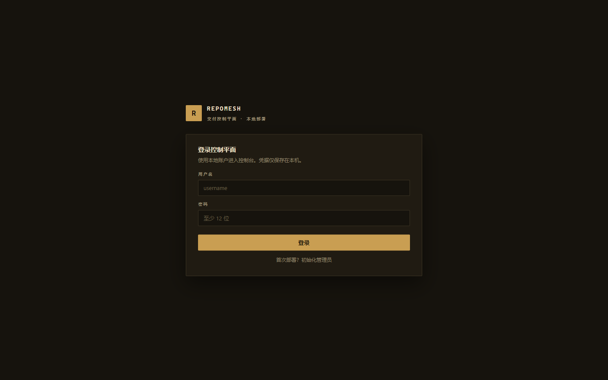
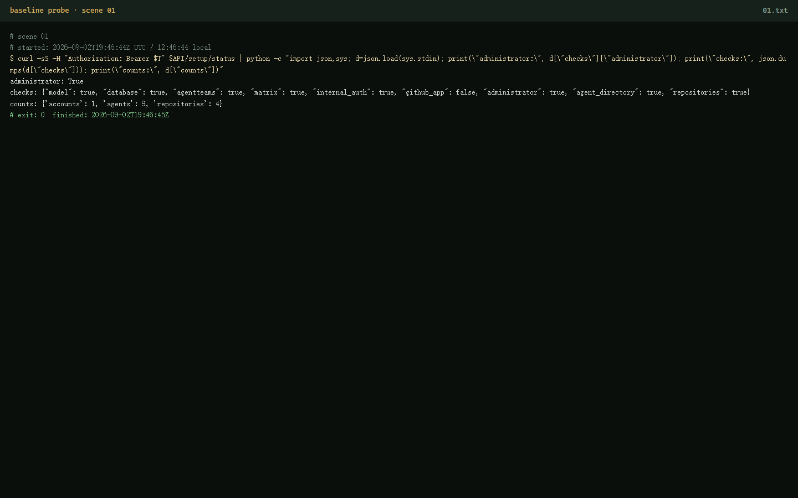

- **操作**：Chrome DevTools 打开 `http://127.0.0.1:5280/`（未登录）；用户随后在同一窗口登录
- **预期**：「登录控制平面」；`GET /api/v1/setup/status` → `administrator: true`
- **实际**：登录门如图；`administrator: True`，九项 checks 除 `github_app` 外全 true，`counts: accounts 1, agents 9, repositories 4`
- **探针**：`curl -sS -H "Authorization: Bearer $T" $API/setup/status | python -c "…"` → `administrator: True`，退出码 0，19:46:44Z（`01.txt`）
- **状态**：PASS
- **耗时**：1 s

### 幕 03 · 仓库页 · 四夹具仓

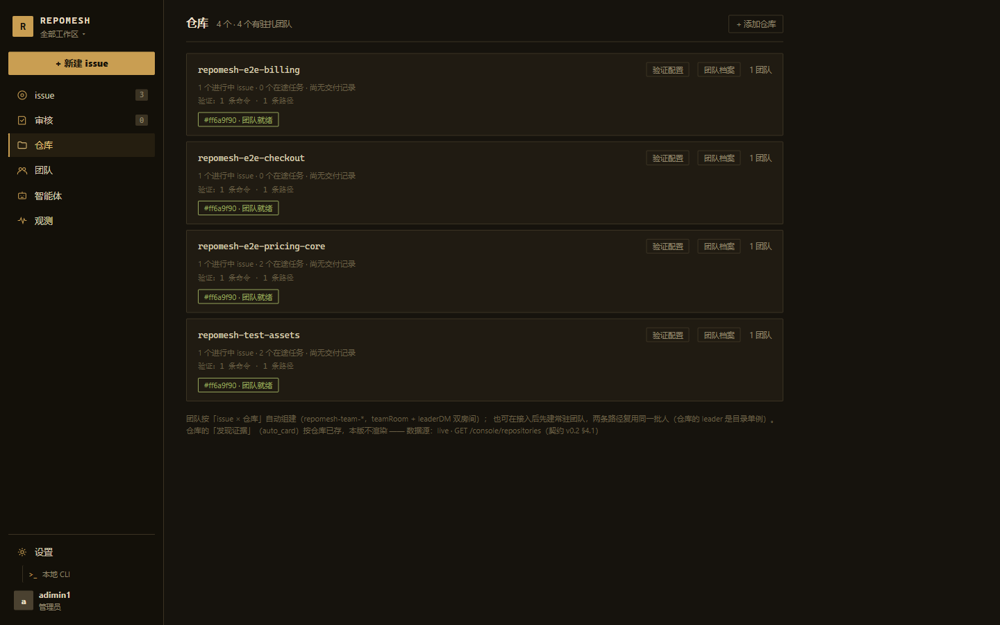
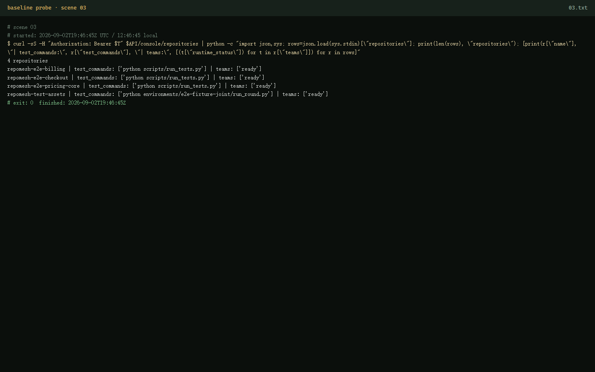

- **操作**：只看 `#/repositories`
- **预期**：四个夹具仓，每仓「验证配置」有测试命令
- **实际**：四仓各一行；`test_commands` 三个业务仓 `python scripts/run_tests.py`，test-assets `python environments/e2e-fixture-joint/run_round.py`；每仓 1 支团队 `ready`
- **探针**：`GET /api/v1/console/repositories` → 4 行 `test_commands` 非空，退出码 0，19:46:45Z / 复跑 20:07:21Z（`03.txt`）
- **状态**：PASS
- **耗时**：1 s

### 幕 05 · 团队页 · 四团队就绪

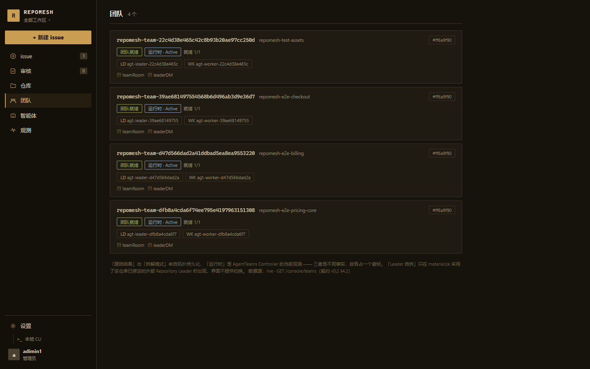
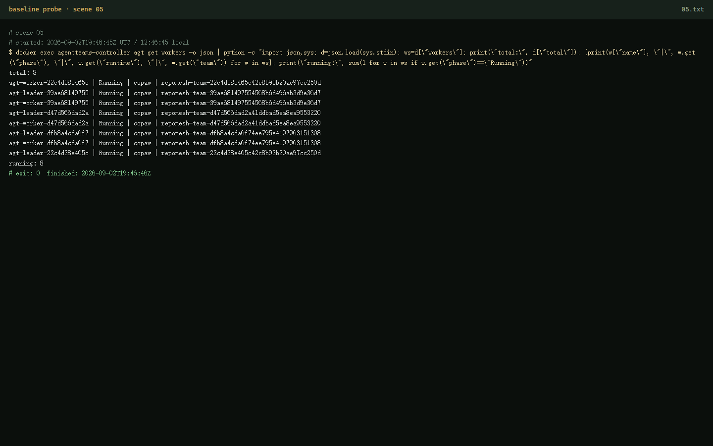

- **操作**：只看 `#/teams`
- **预期**：每团队「团队就绪」+ 运行时 Running；`agt get workers -o json` → 8 个 `phase: Running`
- **实际**：四团队就绪；`agt get workers` 返回 `{workers: [8], total: 8}`，8 个 `Running`，runtime 全 `copaw`。**没有**模式徽章（改造前）
- **探针**：`docker exec agentteams-controller agt get workers -o json | python -c "…"` → `running: 8`，退出码 0，19:46:45Z / 复跑 20:12:45Z（`05.txt`）
- **状态**：PASS
- **耗时**：1 s

### 幕 06 · 智能体页 · 8 个 copaw 运行中

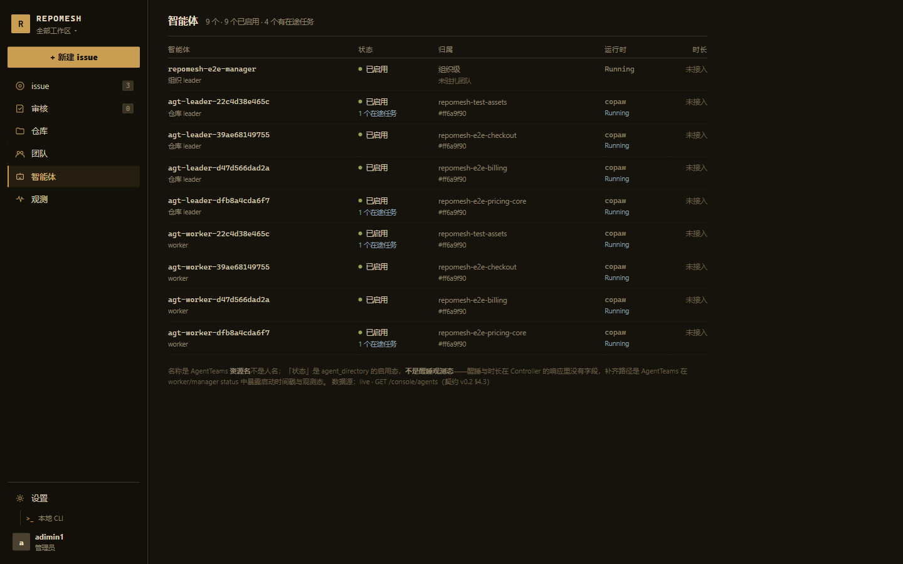
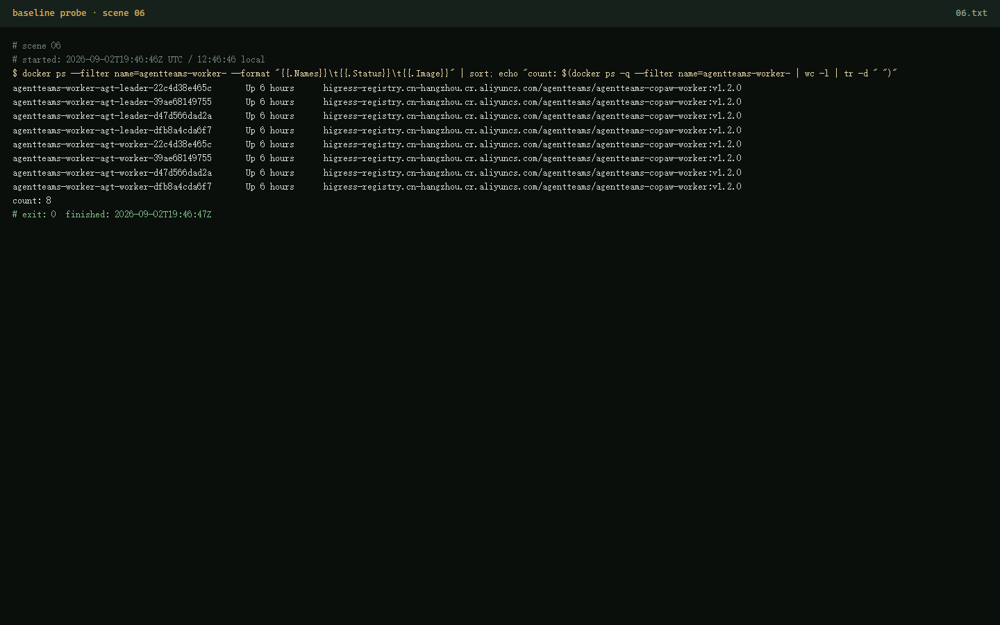

- **操作**：只看 `#/agents`
- **预期**：8 个 copaw Running（组织 Manager 不要求 Running）；`docker ps --filter name=agentteams-worker-` → 8 行 Up
- **实际**：8 行 `Up 6 hours`，镜像 `agentteams-copaw-worker:v1.2.0`；组织 Manager 的 `agentteams-manager-repomesh-e2e-manager` 仍 `Created`（V-2，不计）
- **探针**：`docker ps --filter name=agentteams-worker- --format …` → `count: 8`，退出码 0，19:46:46Z / 复跑 20:16:16Z（`06.txt`）
- **状态**：PASS
- **耗时**：1 s

### 幕 07 · 新建 issue · 多币种需求

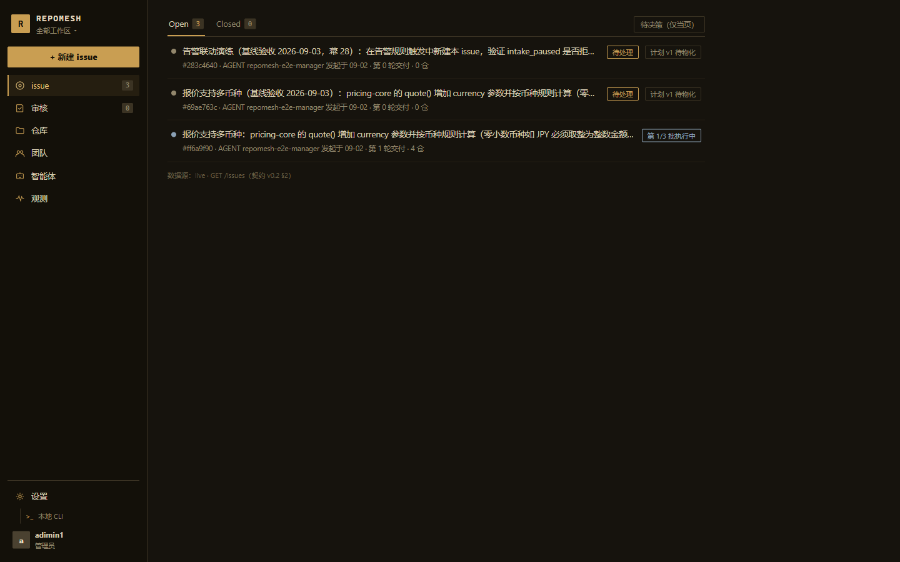
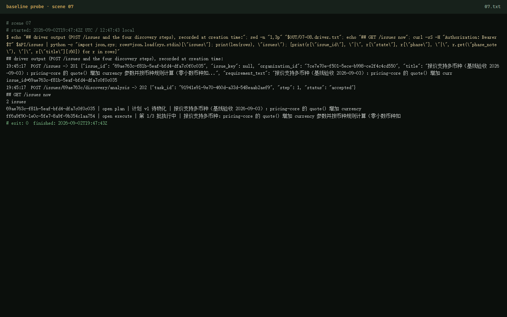

- **操作**：`POST /api/v1/issues`（action token，`created_by_agent_id` = 组织 Manager `703b1dfa…`），需求文本与 09-02 相同并加「基线验收 2026-09-03」前缀（`baseline_issue.py`）
- **预期**：201，列表出现 issue
- **实际**：201，`issue_id=69ae763c-f81b-5eaf-bfd4-dfa7c0f0c035`，19:45:17Z；列表显示「计划 v1 待物化 · 0 仓」。截图时列表还有幕 28 留下的演练 issue `283c4640…`
- **探针**：`GET /api/v1/issues` → 2 行（复跑时 3 行）含 `69ae763c…`，退出码 0，19:47:42Z / 复跑 20:20:51Z（`07.txt`、`07-08.driver.txt`）
- **状态**：PASS
- **耗时**：POST 1 s

### 幕 08 · issue 详情 · 发现链四步

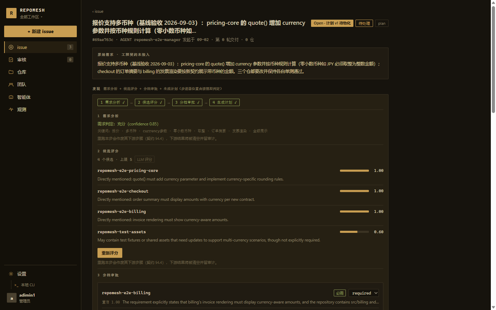
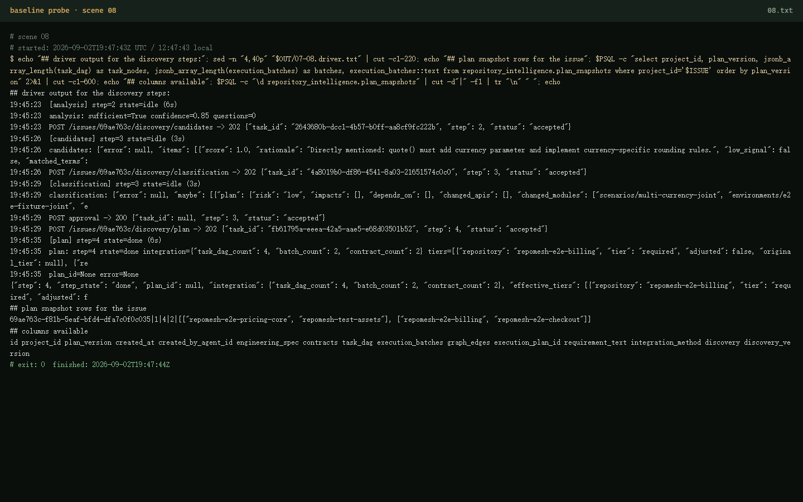

- **操作**：analysis → candidates → classification → approval → plan（真 LLM `deepseek-chat`），不物化
- **预期**：「计划已生成 v1 · 4 个任务节点 · 3 个执行批次」+ DAG；`plan_snapshots.execution_batches` 三批
- **实际**：18 秒跑完（19:45:17 → 19:45:35Z）：analysis `sufficient=True 0.85`（这次没追问）；candidates 三业务仓 1.0；classification REQUIRED 三仓、MAYBE test-assets；plan `task_dag_count 4, batch_count 2, contract_count 2`。`plan_snapshots` 一行：4 节点 **2 批** `[[pricing-core, test-assets], [billing, checkout]]`
- **探针**：`psql: select project_id, plan_version, jsonb_array_length(task_dag), jsonb_array_length(execution_batches), execution_batches::text from repository_intelligence.plan_snapshots where project_id='69ae763c…'` → `1|4|2|…`，退出码 0，19:47:43Z / 复跑 20:25:39Z（`08.txt`）
- **状态**：PASS（批次数 2 ≠ 剧本写的 3，是 LLM 规划差异，见 F-4；`plan_snapshots` 列名是 `project_id` / `plan_version`，剧本里的 `issue_id` 不存在）
- **耗时**：18 s

### 幕 11 · 团队房 pricing-core · 任务包通知（改造前）

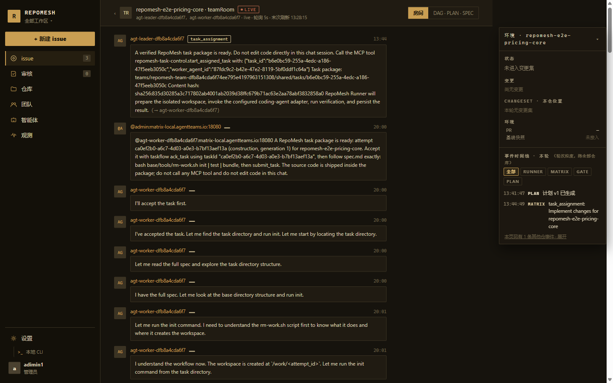
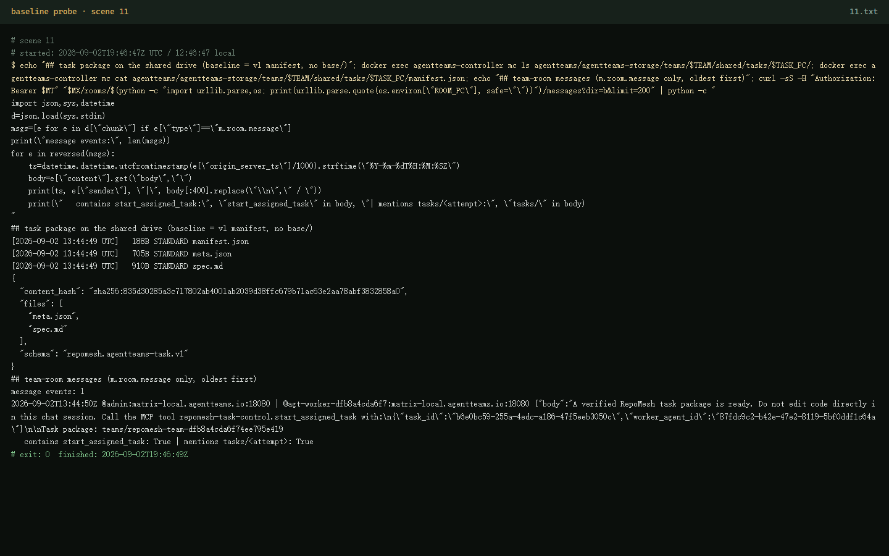
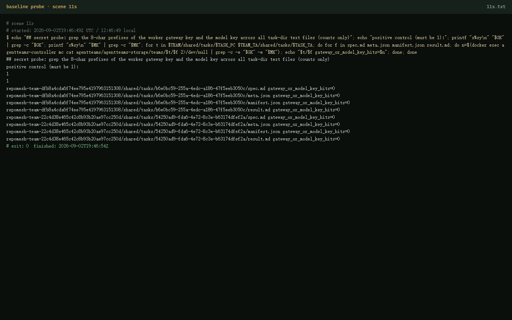

- **操作**：只看 09-02 的派单；`mc ls` 任务包；Matrix `/messages` 抓房间原始事件；密钥探针
- **预期**（基线）：派单含 `start_assigned_task`；任务包只有 v1 三件套、无 `base/`；密钥探针零命中
- **实际**：房间第一条 `m.room.message`（09-02 13:44:50Z，`@admin` → `@agt-worker-dfb8a4cda6f7`）正文含 `start_assigned_task` 与 `Task package: teams/…`；`b6e0bc59…/{manifest.json 188B, meta.json 705B, spec.md 910B}`，manifest `schema: repomesh.agentteams-task.v1`；密钥探针：正对照 1/1，两个任务目录 8 个文件全部 0 命中。**注意**：控制台截图在 20:28Z 拍，此时波次 0 实证已开始，房间时间线里 09-02 的派单之后跟着实证消息
- **探针**：`docker exec agentteams-controller mc ls agentteams/agentteams-storage/teams/repomesh-team-dfb8…/shared/tasks/b6e0bc59…/` + `curl $MX/rooms/<room>/messages?dir=b&limit=200` → `contains start_assigned_task: True`，退出码 0，19:46:47Z / 复跑 20:28:18Z（`11.txt`、`11s.txt`）
- **状态**：PASS（对照面成立）
- **耗时**：2 s + 5 s

### 幕 13 · 团队房 · worker 回执（改造前 = BLOCKED）

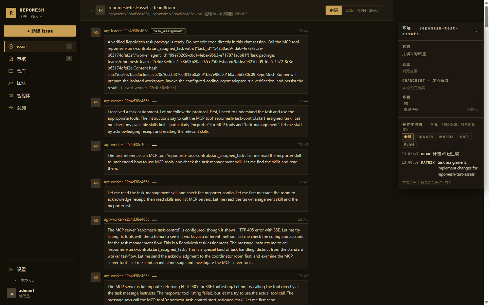
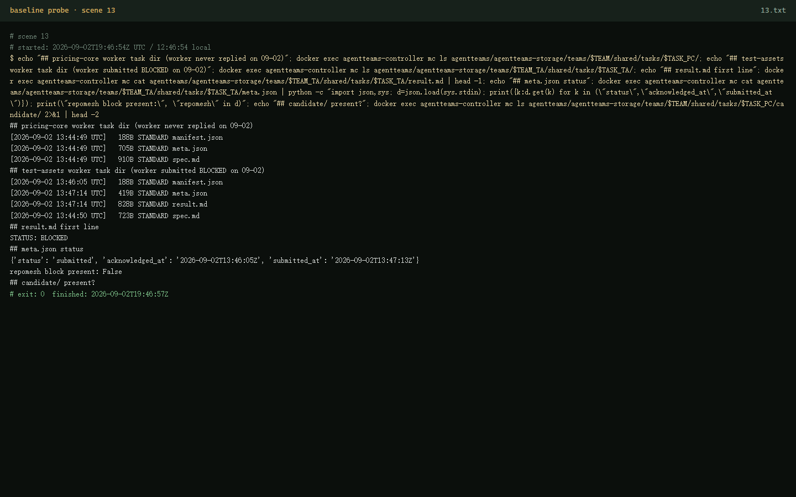

- **操作**：看 test-assets 团队房（09-02 唯一有回执的房）；`mc ls` 两个 worker 任务目录；`mc cat result.md`
- **预期**（基线）：`result.md` 首行 `STATUS: BLOCKED`
- **实际**：pricing-core 目录**没有** `result.md`（worker 09-02 从未回复）；test-assets 目录 `result.md` 首行 `STATUS: BLOCKED`，`meta.json` `status=submitted, acknowledged_at=13:46:05Z, submitted_at=13:47:13Z`，且 **`repomesh` 块已不在 meta.json 里**（copaw 用原生字段重写，见 F-3）；`candidate/` 不存在
- **探针**：`docker exec agentteams-controller mc cat …/54250ad9…/result.md | head -1` → `STATUS: BLOCKED`，退出码 0，19:46:54Z / 复跑 20:30:05Z（`13.txt`）
- **状态**：PASS（对照面成立）
- **耗时**：3 s

### 幕 19 · 观测 → 推理轨迹

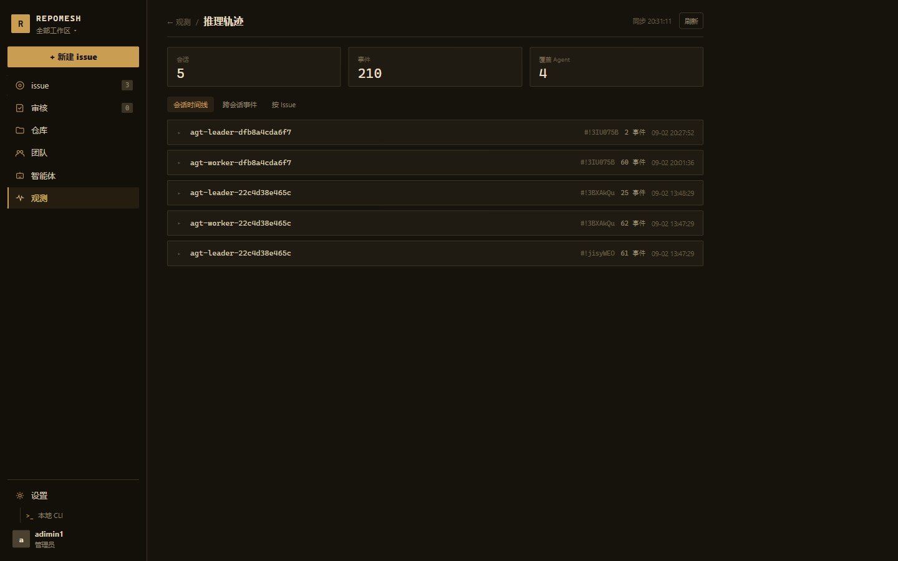
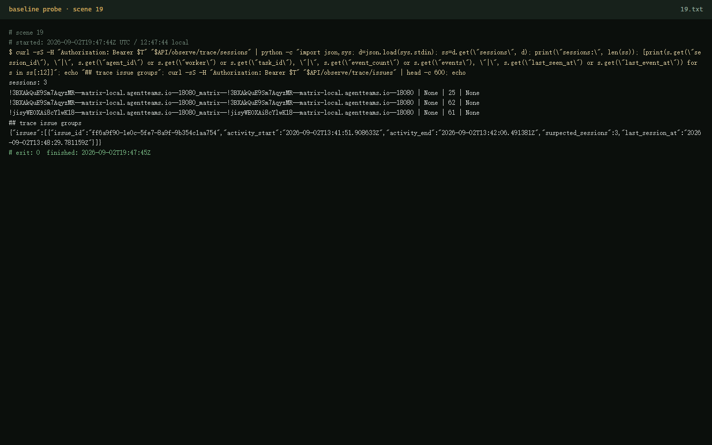

- **操作**：只看 `#/observe/trace`
- **预期**：会话含 worker 与 Leader；`sessions ≥ 4`
- **实际**：19:47Z 基线只有 **3** 个会话（test-assets 团队房 ×2、其 Leader 房 ×1，事件 25/62/61）；20:31Z 复跑 5 个（波次 0 实证给 pricing-core 加了 2 个）。trace 按 issue 归组只有 `ff6a9f90…`（3 个可疑会话）
- **探针**：`GET /api/v1/observe/trace/sessions` → `sessions: 3`（复跑 5），退出码 0，19:47:02Z / 复跑 20:31:14Z（`19.txt`）
- **状态**：PASS（基线本身 3 < 4，剧本的 ≥ 4 是托管原生版口径；见 F-4）
- **耗时**：1 s

### 幕 20 · 观测 → 用量大盘

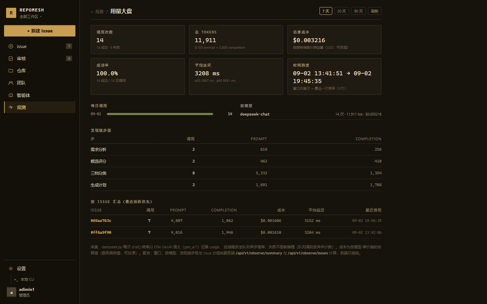
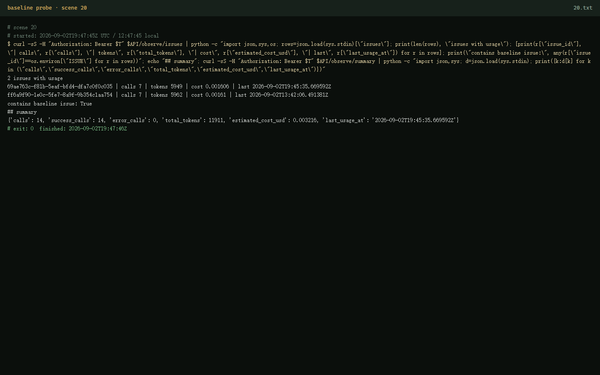

- **操作**：只看 `#/observe/usage`
- **预期**：「按 issue 汇总」非空，含本 issue
- **实际**：2 个 issue 各 7 次调用、约 5.9k token、$0.0016；`contains baseline issue: True`；summary 14 次调用全成功
- **探针**：`GET /api/v1/observe/issues` → 含 `69ae763c…`，退出码 0，19:47:03Z / 复跑 20:38:08Z（`20.txt`）
- **状态**：PASS
- **耗时**：1 s

### 幕 21 · 观测 → 日志（ERROR）

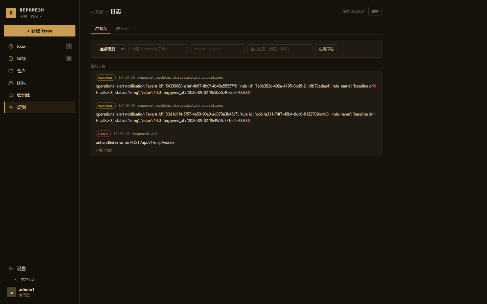
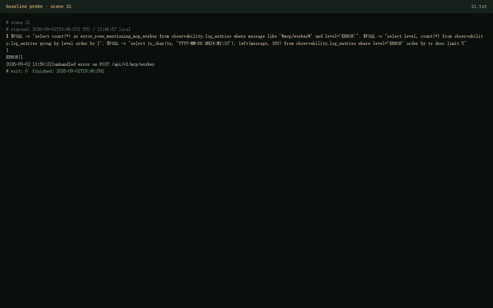

- **操作**：只看 `#/observe/logs`；`psql` 数 ERROR
- **预期**（基线）：有 `unhandled error on POST /api/v1/mcp/worker`（托管原生版必须为零）
- **实际**：`observability.log_entries` 里 ERROR 恰 1 条：`2026-09-02 13:50:22 unhandled error on POST /api/v1/mcp/worker`（V-4 那次代调）；其余级别 0 条
- **探针**：`psql: select count(*) from observability.log_entries where message like '%mcp/worker%' and level='ERROR'` → `1`，退出码 0，19:46:57Z / 复跑 20:42:11Z（`21.txt`）
- **状态**：PASS（对照面成立）
- **耗时**：2 s

### 幕 22 · 观测 → 告警

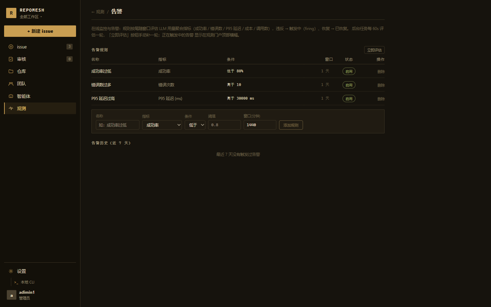
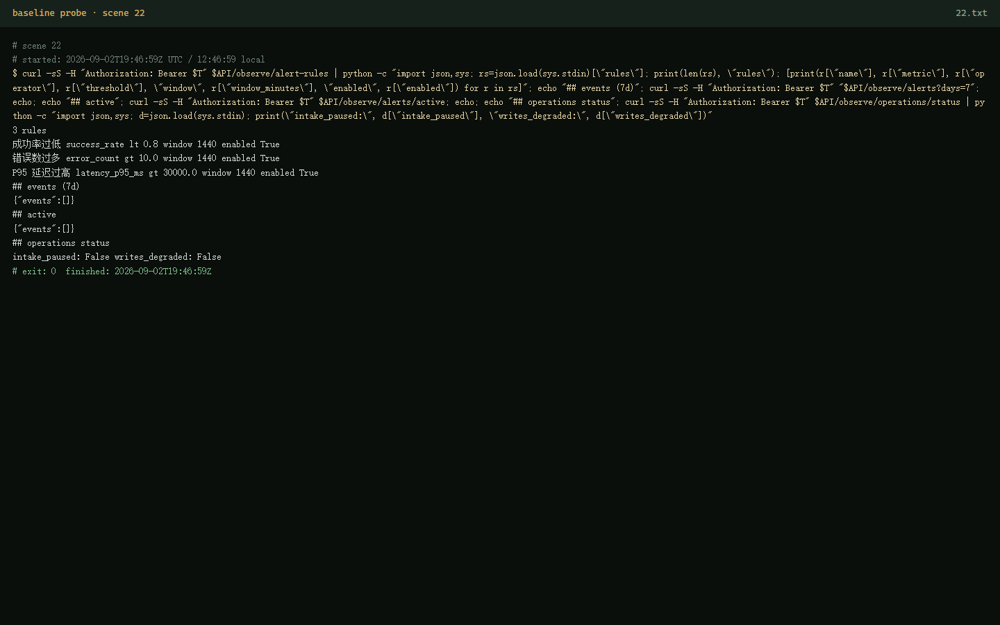

- **操作**：只看 `#/observe/alerts`
- **预期**：默认三条规则；无假触发
- **实际**：`成功率过低 <0.8`、`错误数过多 >10`、`P95 延迟过高 >30000ms`，窗口 1440，全启用；7 天事件 0，活跃 0；`operations/status` `intake_paused=false`
- **探针**：`GET /api/v1/observe/alert-rules` → 3 rules，退出码 0，19:46:59Z / 复跑 20:47:42Z（`22.txt`）
- **状态**：PASS
- **耗时**：1 s

### 幕 28 · 演练 F · 告警联动

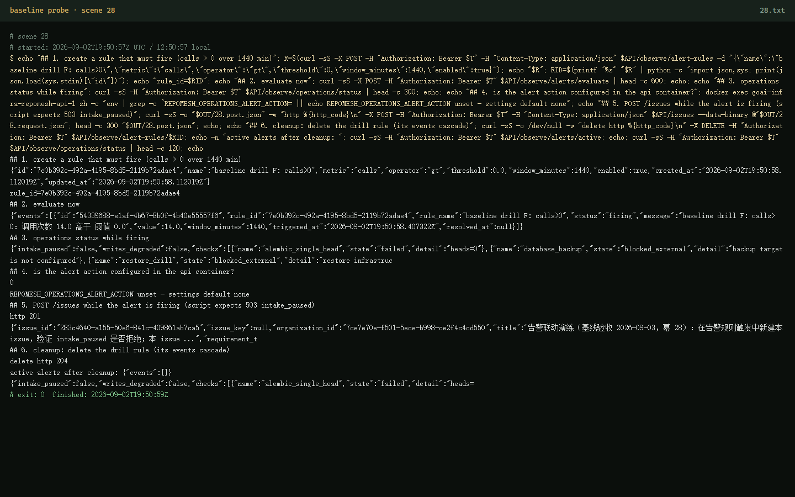

- **操作**：`POST /observe/alert-rules` 建规则 `calls > 0 / 1440 min`（必触发）→ `POST /observe/alerts/evaluate` → `GET /observe/operations/status` → `POST /issues`（演练 issue）→ `DELETE` 规则
- **触发**：规则 `7e0b392c…` 建成，evaluate 立刻 `firing`（`调用次数 14.0 高于 阈值 0.0`）
- **预期**：新建 issue 503 `{"code":"intake_paused"}`（沿用演示 17）
- **实际**：`intake_paused: false`；`POST /issues` → **201**，创建了 `283c4640-a155-50e6-841c-409861ab7ca5`「告警联动演练…」。api 容器里 `REPOMESH_OPERATIONS_ALERT_ACTION` 未设置，`settings.py:214` 默认 `"none"`，告警不联动任何动作
- **恢复**：`DELETE /observe/alert-rules/7e0b392c…` → 204，事件级联删除，活跃告警 0
- **探针**：`curl -sS -o … -w "http %{http_code}" -X POST $API/issues --data-binary @28.request.json` → `http 201`，19:50:58Z（`28.txt`）。控制台截图 20:50Z 显示演练 issue 在列表中；本幕探针改变状态，没有复跑
- **状态**：BLOCKED
- **原因**：F-1（`src/repomesh/settings.py:214` 默认 `none`；演示机器另设了 `pause_intake`）
- **耗时**：2 s

### 幕 30 · 终态账面

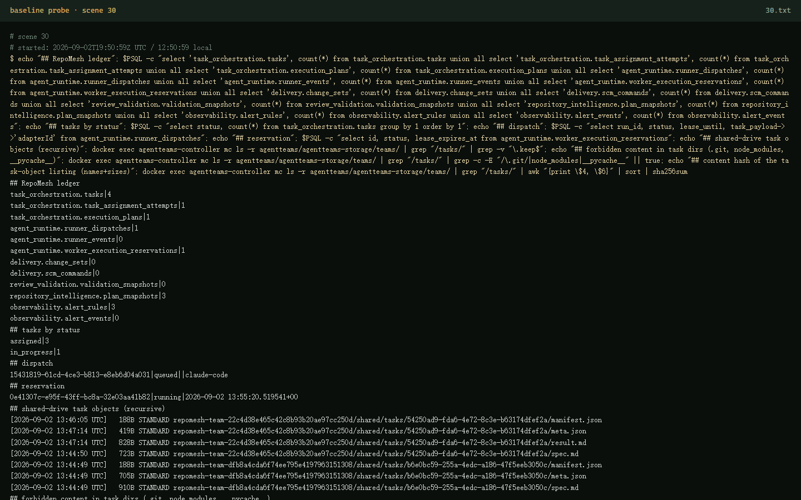

- **操作**：`psql` 数表；`mc ls -r` 共享盘任务对象；禁用内容计数；对象清单哈希
- **预期**：一张表；任务目录无 `.git`、无 `node_modules`
- **实际**：见 §7；禁用内容 0；清单哈希 `1ee6adbe49fe4ce4b487b2edfef4955e574a0002241b9a323439811742db1ebb`
- **探针**：`docker exec agentteams-controller mc ls -r agentteams/agentteams-storage/teams/ | grep /tasks/ | grep -c -E '/\.git/|node_modules|__pycache__'` → `0`，退出码 0，19:50:01Z（`30.txt`）；本幕无控制台页面
- **状态**：PASS
- **耗时**：4 s

## 4. 演练结果

只有幕 28 属于基线版演练。

| 幕 | 触发动作 | 系统反应 | 与预期一致 | 恢复动作 |
|---|---|---|---|---|
| 28 演练 F | 建必触发规则 + evaluate | 规则 firing，但 `intake_paused=false`，`POST /issues` 201 | 否 | `DELETE` 规则 → 204；活跃告警 0；演练 issue `283c4640…` 留在列表（未物化） |

## 5. 挂起裁决

无。幕 28 的 BLOCKED 原因是明确的配置默认值，不需要两种解读。

## 6. 新发现

| # | 严重度 | 现象 | 位置 | 阻断 |
|---|---|---|---|---|
| F-1 | 中 | 告警联动默认不生效：`REPOMESH_OPERATIONS_ALERT_ACTION` 默认 `none`，`.env.example`/`compose.yaml` 都不提；演示截图 17 的 503 依赖非默认配置；剧本幕 28 的预期隐含了这个前提 | `src/repomesh/settings.py:214`；剧本幕 28 | 否 |
| F-2 | 低 | `GET /observe/operations/status` 报 `alembic_single_head: failed, heads=0`（api 容器内发现不到迁移头），运维页会红 | `src/repomesh/modules/observability/operations.py` `discover_alembic_heads` | 否 |
| F-3 | 中（对 spec） | copaw 的 `ack_task`/`submit_task` 用 `TaskMeta` 原生字段重写 `meta.json`，非原生键（含 `repomesh` 块）**全部丢失**；09-02 test-assets 的 meta.json 已无 `repomesh` | `components/agentteams/copaw/src/copaw_worker/task.py:145-170`（`write_task_meta` 写 `asdict(TaskMeta)`） | 否（波次 0 已按此调整包布局） |
| F-4 | 低 | 剧本把上一轮 LLM 输出写成预期：幕 08「3 个执行批次」（本次 2 批）、幕 19「sessions ≥ 4」（基线 3）；这两条应改为「批次 ≥ 1 且覆盖 required 仓」「会话数随施工增长」 | 剧本 §3 幕 08、19 | 否 |
| F-5 | 低 | 8 个 copaw 容器每 5 分钟打一条 `Failed to seed CoPaw built-in skills: cannot import name 'sync_skills_to_working_dir'`（copaw_worker 包装层与 copaw 核心版本不匹配），技能仍装上了 | `docker logs agentteams-worker-*` | 否 |
| F-6 | 信息 | `repository_intelligence.plan_snapshots` 主键是 `project_id` + `plan_version`，没有 `issue_id` 列；剧本幕 08 探针要改 | 剧本 §3 幕 08 | 否 |

## 7. 终态账面（19:50:01Z，波次 0 实证之前）

| 表 / 对象 | 数量 |
|---|---|
| `task_orchestration.tasks` | 4（`assigned` 3、`in_progress` 1） |
| `task_orchestration.task_assignment_attempts` | 1 |
| `task_orchestration.execution_plans` | 1 |
| `agent_runtime.runner_dispatches` | 1（`queued`，`adapterId=claude-code`，`lease_until` 空） |
| `agent_runtime.runner_events` | 0 |
| `agent_runtime.worker_execution_reservations` | 1（`running`，租约 09-02 13:55:20Z 已过期无人回收） |
| `delivery.change_sets` / `scm_commands` | 0 / 0 |
| `review_validation.validation_snapshots` | 0 |
| `repository_intelligence.plan_snapshots` | 2（09-02 一份，本次一份） |
| `observability.alert_rules` / `alert_events` | 3 / 0（演练规则已删） |
| 共享盘任务对象 | 7（`b6e0bc59…` 3 个、`54250ad9…` 4 个），禁用内容 0 |
| 清单哈希（名+大小，排序后 sha256） | `1ee6adbe49fe4ce4b487b2edfef4955e574a0002241b9a323439811742db1ebb` |

## 8. 环境现状与拆除

验收结束时（20:50Z）：

- 14 个本栈容器全活着；`agentteams-worker-agt-worker-dfb8a4cda6f7` 在 20:33:15Z 被波次 0 实证 `docker restart` 过一次（见 `2026-09-03-hosted-native-spike.md`）。
- issue 3 条：`ff6a9f90…`（09-02，执行中假运行）、`69ae763c…`（本次，计划 v1 待物化）、`283c4640…`（幕 28 演练，未跑发现链）。都没有物化，四个 GitHub 夹具仓没有任何推送。
- 平台任务表、dispatch、预留与基线时相同（波次 0 实证不经 RepoMesh 任务表）。
- 共享盘多了波次 0 的 4 个任务目录、worker 容器多了 3 个 `/work/<attempt>` 工作区，归实证记录管。
- 拆除：本报告不需要拆任何东西。若要把环境恢复到基线，删掉两个演练/基线 issue 没有接口，只能留着；波次 0 残留的清理命令见实证记录 §7。
- `output/hosted-native-e2e/2026-09-03/` 里的探针原文与 HTML 渲染不提交。
