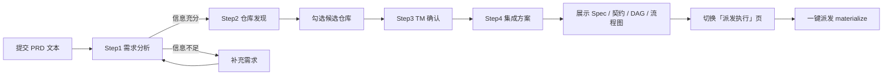

# 方案流程展示环节 — LLM 对接需求

- 仓库地址：`https://github.com/LBP97541135/GOAI-infra-repomesh`
- 文档日期：2026-08-13
- 状态：草案，供前端 / 后端 / 队友评审
- 相关代码：`web/src/PrdPlanner.tsx`、`web/src/DagGraph.tsx`、`web/src/Workspace.tsx`、`web/src/api.ts`、`src/repomesh/modules/repository_intelligence/api/router.py`、`src/repomesh/integrations/llm/deepseek.py`

---

## 1 背景与目标

RepoMesh 的规划链路依赖 LLM 把一份需求文本逐级加工成可执行方案：先是判断需求是否完整，再选定需要改动的仓库，随后由各仓库负责人产出改动计划，最后合并成一份带依赖关系的集成方案。这个过程的终点，是用户能在页面上看到三样东西：方案说明（Engineering Spec）、仓库间契约（Contracts）、以及一张能讲清楚"谁先做、谁依赖谁"的依赖流程图（DAG）。

当前环节的目标是把这条链路在本地完整跑通，并让「方案流程展示」成为前端工作台的固定组成部分：用户提交 PRD 后，四步分析结果逐步呈现，集成方案以结构化区块和流程图两种形式展示，之后可以一键派发执行。

本需求只覆盖到「集成方案展示」为止。派发执行（materialize）及其后续的 Leader 交互不在本需求范围内，仅在交互总览中说明入口。

## 2 角色与术语

| 术语 | 含义 |
|---|---|
| PRD / 需求文本 | 用户在「方案制定」页输入的描述性需求，最长 20000 字 |
| Requirement Analysis | 第一步：判断需求信息是否充分 |
| Discovery | 第二步：从仓库目录中挑选候选仓库并打分 |
| Confirmation | 第三步：各仓库负责人（TM）确认是否参与并给出改动计划 |
| Integration | 第四步：把各仓库计划合并为项目级集成方案 |
| Engineering Spec | 集成方案中的总体技术方案说明（文本） |
| Contracts | 仓库之间的接口契约（生产者 / 消费者 / 接口 / 约定） |
| Task DAG | 任务依赖图：每个仓库一个任务，含依赖关系 |
| Execution Batches | 执行批次：按依赖关系分组的执行顺序 |
| LLM 网关 | 本环境使用的模型代理服务，见第 6 节 |

## 3 端到端交互流程

用户在项目工作台「方案制定」页完成四步，每步结果实时展示，最后进入「派发执行」页。



交互约束：

- 四步必须按顺序推进，任何一步未完成，后续按钮不可用。
- 修改 PRD 文本会使所有下游结果失效：已展示的分析、候选、确认、方案全部清空，回到第一步。
- 每一步请求期间显示加载状态，失败时在页面顶部展示错误信息，不中断已完成的步骤。
- 候选仓库默认全部勾选，用户可以取消勾选后再进入确认。

## 4 功能需求：方案流程展示

### 4.1 第一步 需求分析

用户在文本域输入需求（最少 3 字，最多 20000 字），点击「分析需求」后调用 LLM 判断信息充分性。结果面板展示：

- 结论：信息充分（进入下一步）/ 信息不充分（建议补充），带图标区分。
- 置信度：百分比显示。
- 缺失维度：当信息不充分时，列出缺失的业务维度。
- 待澄清问题：LLM 生成的追问列表，用于引导用户补充需求。
- 提取关键词：用于展示 LLM 对需求的理解。

### 4.2 第二步 仓库发现

点击「发现仓库」后，LLM 从仓库目录中选出可能涉及改动的仓库并打分。结果以候选卡片列表展示：

- 仓库名、置信度分数（百分比）、选择理由（rationale，中文描述该仓库与需求的关联）。
- 每个候选带复选框，默认全选。
- 支持「全部勾选 / 全部取消」快捷操作。
- 空结果：展示空态提示，说明没有匹配到候选仓库，允许用户修改需求重试。

只有勾选中的候选仓库会进入下一步。

### 4.3 第三步 TM 确认

点击「确认仓库」后，LLM 为每个勾选的仓库生成改动计划。结果按仓库分组展示：

- 参与状态（REQUIRED / MAYBE / EXCLUDED），以及各仓库的置信度。
- 改动摘要（plan_summary）：该仓库要做什么。
- 改动接口（changed_apis）、改动模块（changed_modules）。
- 依赖关系（depends_on）、影响范围（impacts）、风险等级（高风险 / 中风险 / 低风险）。
- 缺失依赖提示（missing_dependencies）。

确认结果将作为第四步集成的输入原样回传，展示内容必须与 LLM 返回一致，不丢失字段。

### 4.4 第四步 集成方案展示

点击「生成集成方案」后，页面从上到下依次展示五个区块：

1. **方案说明（Engineering Spec）**：总体方案文本，说明服务拆分、依赖关系约束、各流程的处理链路，用等宽字体块展示。
2. **契约列表（Contracts）**：每条契约展示生产者、消费者、接口、约定内容；区块标题显示契约总数。
3. **任务列表（Task DAG）**：每个仓库一个任务，展示执行指令（instruction）与依赖项（depends_on）。
4. **方案流程图（DagGraph）**：把 Task DAG 的依赖关系画成图，见 4.5。
5. **执行批次**：按批次列出执行顺序，区块标题显示批次总数。

集成方案生成后，通过 `onPlanReady` 回调把方案与需求文本交给工作台，供「派发执行」页使用。

### 4.5 方案流程图展示细则

流程图是「方案流程展示」的核心可视化，绘制规则如下：

| 元素 | 规则 |
|---|---|
| 节点 | 每个仓库一个矩形节点，节点名即仓库名 |
| 批次行 | 按 `execution_batches` 分行，同一批次的仓库并排，行首标注「批次 1 / 批次 2 / …」 |
| 依赖边 | 仅保留两端都在批次内的 `depends_on` 边；箭头由被依赖方指向依赖方；同批次内部依赖画水平弧线，跨批次画垂直曲线 |
| 入口标记 | 没有任何入边的节点标记为「入口」 |
| 图例 | 区分「入口仓库（无上游依赖）」与「依赖方向」，右下角显示「边 X 条 · 节点 Y 个」计数 |
| 空态 | 方案没有执行批次时，显示空态占位，提示生成集成方案后展示流程图 |

渲染数据来自集成方案响应的 `task_dag` 与 `execution_batches` 两个字段，前后端必须保证这两个字段自洽：`task_dag` 中的 `depends_on` 引用的仓库名必须在 `execution_batches` 中存在，否则该条边会被丢弃，导致流程图与任务列表不一致。

## 5 状态与异常处理

| 场景 | 表现 |
|---|---|
| 请求中 | 对应步骤按钮进入加载态并禁用，其余步骤按钮保持原状态 |
| LLM 请求失败（超时 / 断连 / 4xx / 5xx） | 页面顶部展示错误信息，已完成的步骤结果保留，可重新触发该步骤 |
| 修改 PRD | 清空全部下游结果，回到第一步 |
| 第二步无候选 | 空态提示，允许修改需求重试 |
| 第三步未勾选任何仓库 | 阻止进入，提示「请至少勾选一个候选仓库」 |
| 集成方案返回的 DAG 依赖缺失 | 流程图丢弃无法落位的边，图例中的边计数如实反映，不与任务列表强一致 |

## 6 LLM 对接需求

### 6.1 网关配置

当前环境通过自定义网关对接模型，配置位于仓库根目录 `.env`：

```dotenv
DEEPSEEK_API_KEY=sk-tech-001-prod-key-xxxxx
REPOMESH_DEEPSEEK_BASE_URL=http://192.168.77.248:10006/maiya/v1
REPOMESH_DEEPSEEK_MODEL=DeepSeek-V4-Flash
```

- `deepseek_base_url` 与 `deepseek_model` 必须在 `.env` 中使用 `REPOMESH_` 前缀，只有 API Key 支持不带前缀的 `DEEPSEEK_API_KEY` 写法。
- 修改 `.env` 后需要重启后端（8001 端口）才能生效。
- 对接方式：OpenAI 兼容的 `POST {base_url}/chat/completions`，请求体含 `model`、`messages`、`temperature`。

### 6.2 接口契约

方案流程展示环节共涉及 5 个后端接口，全部位于 `/api/v1` 前缀下：

| 接口 | 方法 | 请求要点 | 响应要点 | 用途 |
|---|---|---|---|---|
| `/requirement-analysis` | POST | `requirement`（1–20000 字） | `sufficient`、`confidence`、`missing_dimensions`、`questions`、`extracted_keywords` | 判断需求信息是否充分 |
| `/discovery` | POST | `requirement`、`limit`（1–50，默认 5） | 候选数组：`repository_id`、`repository_name`、`score`、`matched_terms`、`rationale` | 从仓库目录挑选候选仓库 |
| `/confirmation` | POST | `requirement`、`candidate_repos`、`discovery_evidence`、`limit` | `required` / `maybe` / `excluded` 三组结果，每组含 `repository`、`status`、`confidence`、`reason`、`plan_summary`、`plan`、`missing_dependencies` | 各仓库确认参与并产出改动计划 |
| `/integration` | POST | `requirement`、`confirmation`（原样回传上一步响应） | `engineering_spec`、`contracts`、`task_dag`、`execution_batches` | 合并为项目级集成方案 |
| `/bridge/materialize` | POST | 集成方案 + `requirement`、`project_id`、`leader_agent_id`、`idempotency_prefix` | `plan_id`、`task_ids`、`handoff_doc_ids`、`skipped_repos` | 把集成方案落库并派发执行（本需求范围外） |

### 6.3 超时与错误处理

- LLM 请求超时上限为 180 秒。当前网关在收到包含全部仓库信号的超大 prompt 时会断开连接，因此 `/discovery` 的 prompt 只携带仓库的名称、描述、主题、语言四类轻量信号，不携带依赖、目录、提交历史等全量信号。
- LLM 适配层（`deepseek.py`）显式关闭系统代理（`trust_env=False`），避免内网网关请求被本机代理拖至超时。接入新环境时应保持这一行为，除非确认新环境无代理干扰。
- 后端对 LLM 失败有兜底：`/discovery` 在 LLM 失败时回退到关键词匹配。该兜底对中文需求命中率低，不能视为可用结果，前端应按「空候选」处理并提示用户重试。

### 6.4 稳定性要求

- 每个 LLM 请求必须可重试：前端允许用户对任意步骤重新触发，后端请求本身无副作用。
- `/bridge/materialize` 属于外部副作用操作，必须携带 `idempotency_prefix`，重复调用不得产生重复任务。
- 网关响应耗时实测为单步 50–150 秒，属模型与网关能力限制。前端需在请求期间保持界面可交互（允许取消或重新触发），不得因长时间等待触发浏览器层面的二次请求。

## 7 已知问题与后续事项

| 事项 | 说明 | 建议处理 |
|---|---|---|
| API Key 为占位符 | `.env` 中 `sk-tech-001-prod-key-xxxxx` 可能不是真实密钥 | 与网关提供方确认后替换真实值 |
| 网关响应慢 | 单步 50–150 秒，用户体验差 | 后续评估换更快的模型或网关，或增加流式返回 |
| 中文兜底命中率低 | `/discovery` 关键词兜底对中文需求基本无效 | 后端补充中文分词，或明确返回「LLM 不可用」错误而非空结果 |
| 流程图一致性 | 依赖边依赖 `depends_on` 与 `execution_batches` 自洽 | 后端在 `/integration` 返回前校验并补齐缺失节点 |
